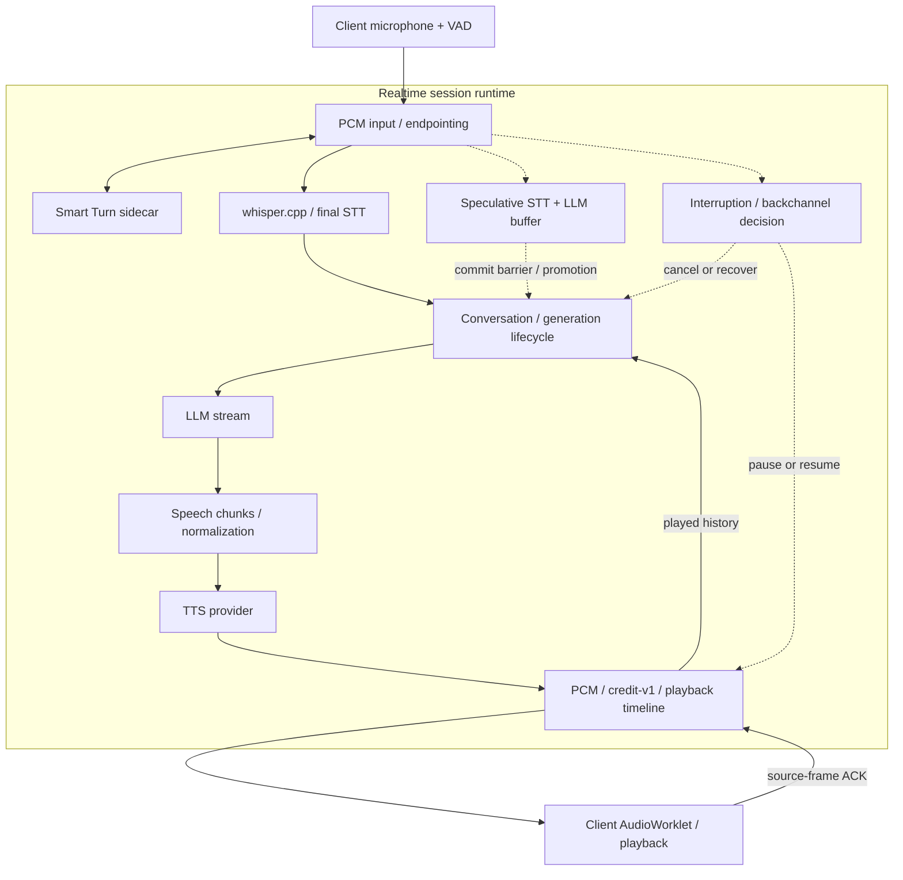

# Yukkuri Realtime Engine

会話AI向けのセルフホスト型リアルタイム音声ランタイムです。STT・LLM・TTSの周囲で、ターン、割り込み、生成、再生の進行を管理し、日本語の音声アプリケーションをサンプルとして提供します。

[English](README.md) | 日本語

[](https://github.com/uthuyomi/yukkuri-realtime-engine/releases/tag/v0.1.0)
[](https://github.com/uthuyomi/yukkuri-realtime-engine/actions/workflows/quality.yml)
[](LICENSE)

**公開リリース：[v0.1.0](https://github.com/uthuyomi/yukkuri-realtime-engine/releases/tag/v0.1.0)** · Public API **v1** · エンジンは **Windows x64** · ローカル開発向けの初期リリースです。

[起動手順](docs/quickstart.ja.md) · [アーキテクチャ](docs/architecture.ja.md) · [SDK](#sdk) · [ドキュメント](#ドキュメント)

クライアントが実際に再生した内容を会話状態に反映し、発話開始時には応答を一時停止、割り込み判定に応じて復帰またはキャンセルします。HTTP/WebSocket APIとTypeScript/Python SDKから、このセッションのライフサイクルを利用できます。

標準構成はローカルのwhisper.cpp・Smart Turn・AquesTalkと、**外部のOpenAI LLMサービス**を組み合わせます。各providerは別々のGo interfaceを持ちますが、ランタイムのセルフホストは構成全体のローカル動作を意味しません。AQUEST資産・モデル・認証情報は別途用意します。

## デモ

Browser Voiceの実録デモは、所有者が後日追加します。[providerの設定](docs/quickstart.ja.md)後に[ブラウザサンプル](examples/typescript/browser-voice/README.md)を起動できます。

<!-- 所有者が確認したBrowser Voiceの実録デモで置き換えてください。実在するメディアだけをリンクしてください。 -->

## 主な機能

- **リアルタイムの対話：** クライアントVAD、Smart Turnと動的な発話終了判定、barge-in、誤割り込みからの復帰、ヒューリスティックな相づち処理。
- **生成のライフサイクル：** 上限付きの先行STT/LLM生成、commit判定後のpromotion、generation単位のキャンセル、複数ターンの会話状態。
- **音声ランタイム：** 意味単位の音声分割、PCM配信、source frame基準のcredit-v1フロー制御、再生状況を反映する履歴、AudioWorkletクライアント。
- **連携：** HTTP/WebSocket Public API v1、TypeScript SDK、Python SDK/CLI、ブラウザサンプル、session/generation IDで相関できるイベント。

## アーキテクチャ



実線は主な音声経路と再生状況のフィードバック、点線は並行する先行生成と割り込み制御です。先行生成はpromotion前にtextや音声を公開できません。providerのノードは連携境界を示し、単一プロセスを意味しません。[詳しいアーキテクチャ](docs/architecture.ja.md)。

## クイックスタート

エンジンの主な対象は**Windows x64**です。`go.mod`の指定はGo **1.27.1**。SDK/CLIにはPython 3.11以上、固定依存のSmart TurnセットアップにはPython 3.13を使用します。ブラウザ／TypeScript SDKにはNode 22以上が必要です。プロプライエタリ資産とモデルは同梱していません。

clone後、provider資産なしでもビルドできます。

```powershell
git clone https://github.com/uthuyomi/yukkuri-realtime-engine.git
cd yukkuri-realtime-engine
go build -o dist/engine.exe ./cmd/engine
if (!(Test-Path .env)) { Copy-Item .env.example .env }
# 音声会話にはローカルproviderとOPENAI_API_KEYの設定が必要です。
go run ./cmd/engine
```

TTS/STT/LLMが未設定なら対応サービスを無効にします。STTの起動確認には時間がかかる場合があります。初期化後の`/health`はプロセスの生存確認であり、providerの準備完了を保証しません。`http://127.0.0.1:8765/v1/capabilities`を確認してください。

**音声会話の手順は[Quickstart EN](docs/quickstart.md) / [日本語](docs/quickstart.ja.md)**を参照してください。AquesTalk/AqKanji2Koeの別途入手、whisper.cppのビルドとモデル取得、Smart Turnの起動、外部LLMの設定が必要です。

## Browser Voice Demo

provider設定後、Smart Turnとエンジンを起動したまま、リポジトリルートで実行します。

```powershell
npm --prefix sdk/typescript ci
npm --prefix sdk/typescript run build
python -m http.server 8080 --bind 127.0.0.1
```

<http://127.0.0.1:8080/examples/typescript/browser-voice/>を開き、「接続」「マイク開始」を押してマイクを許可します。テキスト入力も利用できます。Silero/ONNX資産は固定バージョンのCDNから取得します。開発用HTTPサーバーはローカルファイルを含むcheckout全体を配信するため、loopback以外に公開しないでください。

会話・計測履歴はページ内メモリに保持します。エンジン再接続後も残りますが、ページ再読み込みで消えます。未計測は`—`とし、サーバー時間やPCM受信時間を可聴時間として表示しません。

## API

| Endpoint | 用途 |
| --- | --- |
| `GET /health` | HTTPプロセスの生存確認 |
| `GET /v1/capabilities` | 設定済み機能・形式・上限 |
| `POST /v1/audio/speech` | 単独の音声合成 |
| `WS /v1/realtime` | 会話／クライアント提供応答 |
| `WS /v1/transcription` | 確定文字起こし |

[HTTP API](docs/api.md) · [Protocol EN](docs/realtime-protocol.md) / [日本語](docs/realtime-protocol.ja.md) · [エラー](docs/errors.md)

## SDK

TypeScript：ローカルSDKをビルドし、アプリに`./sdk/typescript`をインストールします。

```ts
import {YukkuriClient} from '@yukkuri-realtime/client';
const client = new YukkuriClient({baseUrl: 'http://127.0.0.1:8765'});
const session = await client.realtime.connect();
session.on('textDelta', e => console.log(e.delta));
try { await (await session.sendText('こんにちは', {output: 'text'})).done; }
finally { await session.close(); }
```

Python：`python -m pip install -e ./sdk/python`でインストールします。

```python
import asyncio
from yukkuri_realtime import YukkuriClient

async def main():
    async with YukkuriClient() as client:
        async with await client.realtime.connect() as session:
            session.on('text_delta', lambda e: print(e['delta'], end=''))
            generation = await session.send_text('こんにちは')
            await generation.wait_done(timeout=130)

asyncio.run(main())
```

同じPython環境でCLIを利用できます。

```powershell
python -m yukkuri_realtime health
python -m yukkuri_realtime capabilities
python -m yukkuri_realtime speak "こんにちは" --output hello.wav
python -m yukkuri_realtime transcribe input.wav
python -m yukkuri_realtime realtime
```

[TypeScript](docs/typescript-sdk.md) · [Python](docs/python-sdk.md) · [CLI](docs/cli.md)。CLIのrealtimeはテキスト入出力です。生成完了はスピーカーの再生完了ではありません。npm/PyPIでの公開は前提にしていません。

## Providers

現在の実装はAquesTalk＋AqKanji2Koe（Windows DLL）、whisper.cppの常駐／プロセス方式、OpenAI Responsesストリーミング、Smart Turn v3.2 CPUサイドカー、multisignal方式の日本語相づちヒューリスティックです。[EN](docs/providers.md) / [日本語](docs/providers.ja.md)

## 性能

ユーザー報告の初期実マイク観測：**GTX 1660 6GB**、whisper.cpp **CUDA / small / persistent**、**完了4ターン**。Server TTFAはp50 **2.11秒**、p95 **2.40秒**、min **2.09秒**、max **2.40秒**。割り込みターンは除外しています。極めて少数の観測で、**管理されたベンチマークではありません**。リリース準備中に独立した再測定は行っていません。Server TTFAは可聴時間を保証しません。[定義・出典・丸め値の注意 EN](docs/performance.md) / [日本語](docs/performance.ja.md)

## ドキュメント

| 項目 | English | 日本語 |
| --- | --- | --- |
| アーキテクチャ | [EN](docs/architecture.md) | [JA](docs/architecture.ja.md) |
| 起動手順 | [EN](docs/quickstart.md) | [JA](docs/quickstart.ja.md) |
| 設定 | [EN](docs/configuration.md) | [JA](docs/configuration.ja.md) |
| Protocol | [EN](docs/realtime-protocol.md) | [JA](docs/realtime-protocol.ja.md) |
| Providers | [EN](docs/providers.md) | [JA](docs/providers.ja.md) |
| 性能 | [EN](docs/performance.md) | [JA](docs/performance.ja.md) |
| トラブルシューティング | [EN](docs/troubleshooting.md) | [JA](docs/troubleshooting.ja.md) |

[TypeScript SDK](docs/typescript-sdk.md) · [Python SDK](docs/python-sdk.md) · [CLI](docs/cli.md)

[開発・テスト](CONTRIBUTING.md) · [セキュリティ](SECURITY.md) · [変更履歴](CHANGELOG.md) · [リリース準備報告](docs/release-quality.md)

## 現状と制限

- 標準エンジン実行ファイルはWindows専用です。core／SDKの移植可能なテストはLinux/macOS版エンジンのビルド対応を意味しません。
- 認証、永続的な会話、自動再接続、replay、session復元はありません。認証のないサービスはloopbackで利用してください。
- STTは確定結果のみです。キャンセルで常駐workerを終了・再ロードするため、次の要求はウォーム状態の速度を失う場合があります。
- 相づち判定はヒューリスティックで、短い訂正は曖昧になる場合があります。ブラウザAEC/NSとVADは端末条件に依存します。
- AquesTalkは同期ネイティブ呼び出しで、Go contextでは強制中断できません。Windowsのnative pointer境界には記録済みの`go vet`警告があります。
- 再生の線形リサンプラーは帯域制限型の高品質変換ではありません。可聴開始とTTS開始時刻は未計測です。
- 会話／先行生成の観測イベントはbest effortです。メタデータ欠落時はブラウザの相関や統計が不完全になる場合があります。

## ライセンス

Yukkuri Realtime Engine独自のコードとプロジェクト作成文書には、別途記載のあるものを除き、MIT Licenseが適用されます。[LICENSE](LICENSE)を参照してください。第三者の依存ソフトウェア・資産には、それぞれのライセンスと条件が適用されます。AquesTalk/AqKanji2KoeはAQUESTのプロプライエタリソフトウェアで、本プロジェクトのMITの対象外です。資産と必要な利用許諾はAQUESTから別途取得してください。
