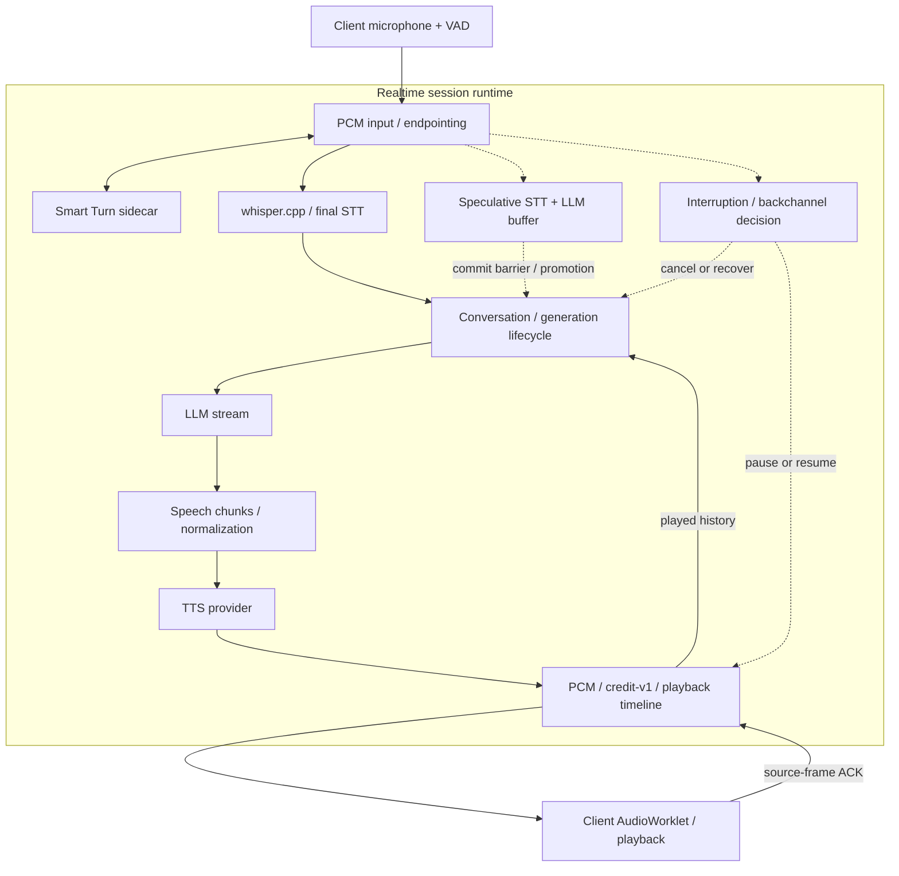

# Yukkuri Realtime Engine

A self-hosted realtime voice runtime for conversational AI. Coordinates turns, interruptions, generation and playback around STT, LLM and TTS, with a Japanese voice application as the supplied example.

English | [日本語](README.ja.md)

[](https://github.com/uthuyomi/yukkuri-realtime-engine/releases/tag/v0.1.0)
[](https://github.com/uthuyomi/yukkuri-realtime-engine/actions/workflows/quality.yml)
[](LICENSE)

**Current release: [v0.1.0](https://github.com/uthuyomi/yukkuri-realtime-engine/releases/tag/v0.1.0)** · Public API **v1** · **Windows x64** engine · Early release for local development.

[Start here](docs/quickstart.md) · [Architecture](docs/architecture.md) · [SDKs](#sdks) · [Documentation](#documentation)

The runtime keeps conversation state aligned with what the client has actually played, pauses on speech onset, and either resumes or cancels the response after an interruption decision. HTTP/WebSocket APIs and TypeScript/Python SDKs connect your client to that session lifecycle.

The supplied setup combines local whisper.cpp, Smart Turn and AquesTalk with an **external OpenAI LLM service**. Providers have distinct Go interfaces; self-hosting the runtime does not make this whole configuration local. AQUEST assets, models and credentials are obtained separately.

## Demo

Real Browser Voice session using the realtime pipeline: microphone input → VAD/turn detection → STT → LLM → AquesTalk → streaming playback.

The recording also demonstrates barge-in: the user interrupts an active response, the current generation is stopped, and the conversation continues with a new response.

[Watch the Browser Voice demo](docs/assets/yukkuri-realtime-engine-demo.mp4)

The Browser Voice example also displays per-turn STT/LLM/Server TTFA measurements and interruption state.

## Highlights

- **Realtime interaction:** client VAD, Smart Turn/dynamic endpointing, barge-in, false-interruption recovery and heuristic backchannel handling.
- **Generation lifecycle:** bounded speculative STT/LLM work, promotion behind a commit barrier, generation-scoped cancellation and multi-turn conversation state.
- **Audio runtime:** semantic speech chunks, PCM streaming, source-frame credit-v1 flow control and playback-aware history, with an AudioWorklet client.
- **Integration:** HTTP/WebSocket Public API v1, TypeScript SDK, Python SDK/CLI, a browser example and correlated session/generation events.

## Architecture



Solid arrows show the main voice path and playback feedback; dotted arrows show concurrent speculation and interruption control. Speculation cannot publish text or audio before promotion. Provider nodes show integration boundaries, not a single process. [Detailed architecture](docs/architecture.md).

## Quick Start

Primary engine target: **Windows x64**, Go **1.27.1** as declared in `go.mod`. Python 3.11+ is needed for the SDK/CLI; use Python 3.13 for the pinned Smart Turn setup. Node 22+ is needed for browser/TypeScript SDK builds. No proprietary files or model downloads are included.

From a clone, a provider-free build is possible:

```powershell
git clone https://github.com/uthuyomi/yukkuri-realtime-engine.git
cd yukkuri-realtime-engine
go build -o dist/engine.exe ./cmd/engine
if (!(Test-Path .env)) { Copy-Item .env.example .env }
# Configure local providers and OPENAI_API_KEY before the full voice flow.
go run ./cmd/engine
```

Missing TTS/STT/LLM disables the corresponding service. STT startup probing can take time; `/health` becomes reachable after initialization and indicates process health, not provider readiness. Inspect `http://127.0.0.1:8765/v1/capabilities`.

**For a working voice setup, follow [Quickstart EN](docs/quickstart.md) / [JA](docs/quickstart.ja.md)**: obtain AquesTalk/AqKanji2Koe separately, build whisper.cpp, download a model, start Smart Turn and configure the external LLM.

## Browser Voice Demo

After provider setup, keep Smart Turn and the engine running. From the repository root:

```powershell
npm --prefix sdk/typescript ci
npm --prefix sdk/typescript run build
python -m http.server 8080 --bind 127.0.0.1
```

Open <http://127.0.0.1:8080/examples/typescript/browser-voice/>, click 接続, then マイク開始 and grant microphone permission. Text input is also available. The example fetches pinned Silero/ONNX assets from CDN. Serve only on loopback: this development server exposes the checkout, including local files. Do not expose it to a network.

Conversation and latency history remain in page memory, across engine reconnects but not page reloads. Missing measurements display `—`; server timing and PCM receipt are never presented as audible timing.

## API

| Endpoint | Purpose |
| --- | --- |
| `GET /health` | HTTP process health |
| `GET /v1/capabilities` | Configured features, formats, limits |
| `POST /v1/audio/speech` | Standalone TTS |
| `WS /v1/realtime` | Realtime conversation / supplied response |
| `WS /v1/transcription` | Final-only transcription |

[HTTP API](docs/api.md) · [Protocol EN](docs/realtime-protocol.md) / [JA](docs/realtime-protocol.ja.md) · [Errors](docs/errors.md)

## SDKs

TypeScript (build the local SDK first; install `./sdk/typescript` in your application):

```ts
import {YukkuriClient} from '@yukkuri-realtime/client';
const client = new YukkuriClient({baseUrl: 'http://127.0.0.1:8765'});
const session = await client.realtime.connect();
session.on('textDelta', e => console.log(e.delta));
try { await (await session.sendText('こんにちは', {output: 'text'})).done; }
finally { await session.close(); }
```

Python (`python -m pip install -e ./sdk/python`):

```python
import asyncio
from yukkuri_realtime import YukkuriClient

async def main():
    async with YukkuriClient() as client:
        async with await client.realtime.connect() as session:
            session.on('text_delta', lambda e: print(e['delta'], end=''))
            generation = await session.send_text('こんにちは')
            await generation.wait_done(timeout=130)

asyncio.run(main())
```

CLI (same Python installation):

```powershell
python -m yukkuri_realtime health
python -m yukkuri_realtime capabilities
python -m yukkuri_realtime speak "こんにちは" --output hello.wav
python -m yukkuri_realtime transcribe input.wav
python -m yukkuri_realtime realtime
```

[TypeScript](docs/typescript-sdk.md) · [Python](docs/python-sdk.md) · [CLI](docs/cli.md). CLI realtime is text input/output, not a microphone client. Generation completion is not speaker completion. No npm/PyPI publication is assumed.

## Providers

Current integrations: AquesTalk + AqKanji2Koe (Windows DLLs), whisper.cpp persistent/process runtime, OpenAI Responses streaming, Smart Turn v3.2 CPU sidecar, multisignal Japanese backchannel heuristic. [Providers EN](docs/providers.md) / [JA](docs/providers.ja.md).

## Performance

User-reported initial real-microphone observation on **GTX 1660 6GB**, whisper.cpp **CUDA / small / persistent**, **4 completed turns**: Server TTFA p50 **2.11 s**, p95 **2.40 s**, min **2.09 s**, max **2.40 s**. An interrupted turn was excluded. This extremely small sample is **not a controlled benchmark** and was not independently reproduced in release preparation. Server TTFA is not guaranteed audible latency. [Definitions, provenance and sample-rounding caveat EN](docs/performance.md) / [JA](docs/performance.ja.md).

## Documentation

| Topic | English | 日本語 |
| --- | --- | --- |
| Architecture | [EN](docs/architecture.md) | [JA](docs/architecture.ja.md) |
| Quickstart | [EN](docs/quickstart.md) | [JA](docs/quickstart.ja.md) |
| Configuration | [EN](docs/configuration.md) | [JA](docs/configuration.ja.md) |
| Protocol | [EN](docs/realtime-protocol.md) | [JA](docs/realtime-protocol.ja.md) |
| Providers | [EN](docs/providers.md) | [JA](docs/providers.ja.md) |
| Performance | [EN](docs/performance.md) | [JA](docs/performance.ja.md) |
| Troubleshooting | [EN](docs/troubleshooting.md) | [JA](docs/troubleshooting.ja.md) |

[TypeScript SDK](docs/typescript-sdk.md) · [Python SDK](docs/python-sdk.md) · [CLI](docs/cli.md)

[Contributing/tests](CONTRIBUTING.md) · [Security](SECURITY.md) · [Changelog](CHANGELOG.md) · [Release preparation report](docs/release-quality.md)

## Current status / limitations

- The supplied engine executable is Windows-only; portable core and SDK tests do not imply a Linux/macOS engine build.
- No authentication, durable conversation, automatic reconnect, replay or session restoration. Keep the unauthenticated service on loopback.
- Final-only STT; cancellation kills/reloads the persistent worker, so the next request may lose warm-model latency.
- Backchannel recognition is heuristic; short corrections can be ambiguous. Browser AEC/NS and VAD depend on browser/device conditions.
- AquesTalk calls are synchronous native calls, not forcibly preemptible by Go context cancellation. The Windows native pointer boundary has a documented `go vet` warning.
- Linear playback resampling is not a band-limited high-quality resampler. Client audible onset and TTS start timing are unmeasured.
- Conversation/speculation telemetry is best effort. Browser correlation/aggregate can remain incomplete when metadata is absent.

## License

Original Yukkuri Realtime Engine code and project-authored documentation are licensed under the MIT License unless otherwise noted. See [LICENSE](LICENSE). Third-party dependencies and assets retain their own licenses and terms. AquesTalk/AqKanji2Koe are proprietary AQUEST software, outside this project's MIT scope: obtain assets and applicable usage rights separately from AQUEST.
