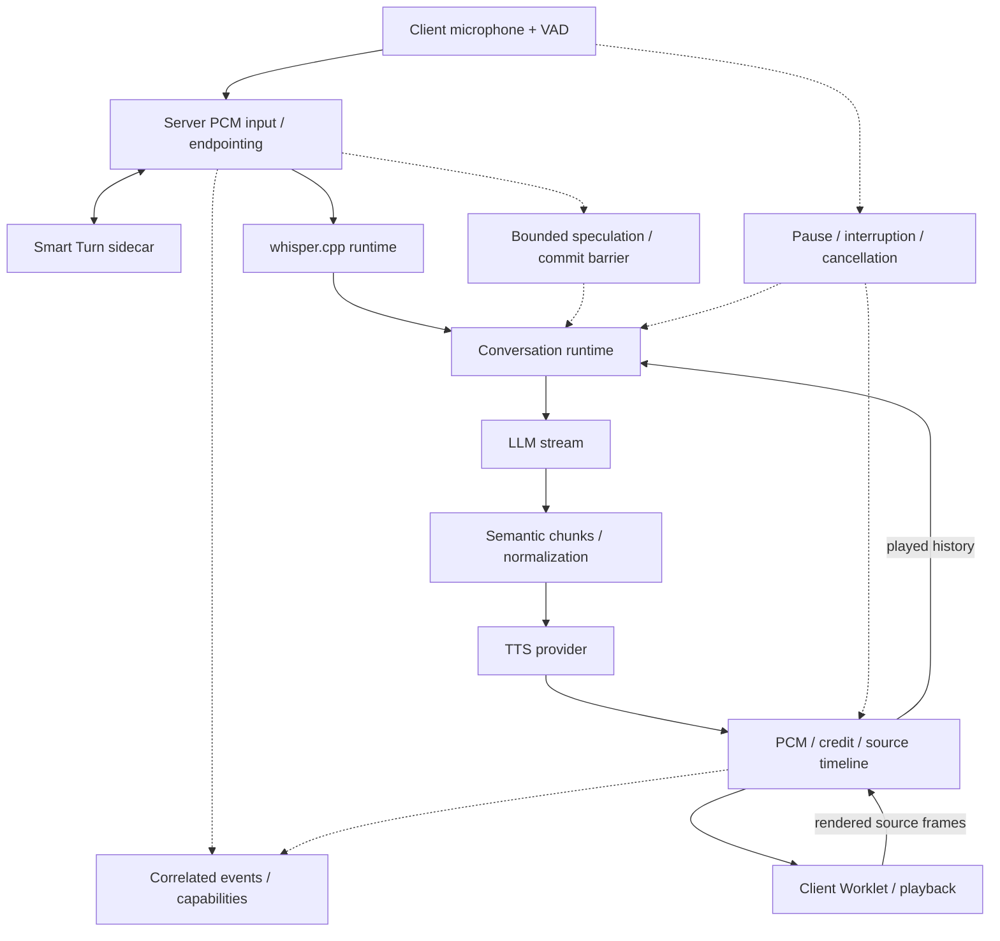

# Yukkuri Realtime Engine

English | [日本語](README.ja.md)

A self-hosted realtime voice engine/runtime for Japanese voice applications. **v0.1.0 is an early release target**, with Public API **v1**; it is not a production-maturity claim.

## What is it?

The engine coordinates microphone input, endpoint decisions, transcription, conversation context, streaming language-model responses and speech playback. Clients use HTTP/WebSocket APIs or the TypeScript/Python SDKs; the browser example is one client, not the engine's architecture.

AquesTalk is the current flagship local TTS provider. STT, LLM, TTS, turn detection and backchannel decisions have distinct Go provider boundaries. The supplied entry point uses local whisper.cpp and Smart Turn, plus an **external OpenAI LLM service** when configured. Self-hosting the runtime does not make that whole configuration local.

## Features

- Client VAD integration, continuous PCM input and server Smart Turn/dynamic endpointing.
- Persistent whisper.cpp transcription with CPU/CUDA selection; authoritative final transcripts, not incremental partial STT.
- LLM streaming, semantic speech chunks, normalized TTS input and PCM streaming.
- Generation-scoped cancellation, barge-in, tentative pause, false-interruption recovery and heuristic backchannel handling.
- Bounded speculative STT/LLM work, published only after formal promotion.
- Multi-turn conversation with playback-aware history; source-frame credit-v1 backpressure.
- Browser AudioWorklet ring buffer/resampler, capability discovery and correlated event observability.

## Architecture



[Architecture: English](docs/architecture.md) · [日本語](docs/architecture.ja.md)

## Quick Start

Primary engine target: **Windows x64**, Go **1.27.1** as declared in `go.mod`. Python 3.11+ is needed for the SDK/CLI; use Python 3.13 for the pinned Smart Turn setup. Node 22+ is needed for browser/TypeScript SDK builds. No proprietary files or model downloads are included.

From a clone, a provider-free build is possible:

```powershell
git clone https://github.com/uthuyomi/yukkuri-realtime-engine.git
cd yukkuri-realtime-engine
go build -o dist/engine.exe ./cmd/engine
Copy-Item .env.example .env
# Configure local providers and OPENAI_API_KEY before the full voice flow.
go run ./cmd/engine
```

Missing TTS/STT/LLM disables the corresponding service. STT startup probing can take time; `/health` becomes reachable after initialization and indicates process health, not provider readiness. Inspect `http://127.0.0.1:8765/v1/capabilities`.

**For a working voice setup, follow [Quickstart EN](docs/quickstart.md) / [JA](docs/quickstart.ja.md)**: obtain AquesTalk/AqKanji2Koe separately, build whisper.cpp, download a model, start Smart Turn and configure the external LLM.

## Browser Voice Demo

After provider setup, keep Smart Turn and the engine running. From the repository root:

```powershell
npm --prefix sdk/typescript ci
npm --prefix sdk/typescript run build
python -m http.server 8080 --bind 127.0.0.1
```

Open <http://127.0.0.1:8080/examples/typescript/browser-voice/>, click 接続, then マイク開始 and grant microphone permission. Text input is also available. The example fetches pinned Silero/ONNX assets from CDN. Serve only on loopback: this development server exposes the checkout, including local files. Do not expose it to a network.

Conversation and latency history remain in page memory, across engine reconnects but not page reloads. Missing measurements display `—`; server timing and PCM receipt are never presented as audible timing.

## API

| Endpoint | Purpose |
| --- | --- |
| `GET /health` | HTTP process health |
| `GET /v1/capabilities` | Configured features, formats, limits |
| `POST /v1/audio/speech` | Standalone TTS |
| `WS /v1/realtime` | Realtime conversation / supplied response |
| `WS /v1/transcription` | Final-only transcription |

[HTTP API](docs/api.md) · [Protocol EN](docs/realtime-protocol.md) / [JA](docs/realtime-protocol.ja.md) · [Errors](docs/errors.md)

## SDKs

TypeScript (build the local SDK first; install `./sdk/typescript` in your application):

```ts
import {YukkuriClient} from '@yukkuri-realtime/client';
const client = new YukkuriClient({baseUrl: 'http://127.0.0.1:8765'});
const session = await client.realtime.connect();
session.on('textDelta', e => console.log(e.delta));
try { await (await session.sendText('こんにちは', {output: 'text'})).done; }
finally { await session.close(); }
```

Python (`python -m pip install -e ./sdk/python`):

```python
import asyncio
from yukkuri_realtime import YukkuriClient

async def main():
    async with YukkuriClient() as client:
        async with await client.realtime.connect() as session:
            session.on('text_delta', lambda e: print(e['delta'], end=''))
            generation = await session.send_text('こんにちは')
            await generation.wait_done(timeout=130)

asyncio.run(main())
```

CLI (same Python installation):

```powershell
python -m yukkuri_realtime health
python -m yukkuri_realtime capabilities
python -m yukkuri_realtime speak "こんにちは" --output hello.wav
python -m yukkuri_realtime transcribe input.wav
python -m yukkuri_realtime realtime
```

[TypeScript](docs/typescript-sdk.md) · [Python](docs/python-sdk.md) · [CLI](docs/cli.md). CLI realtime is text input/output, not a microphone client. Generation completion is not speaker completion. No npm/PyPI publication is assumed.

## Providers

Current integrations: AquesTalk + AqKanji2Koe (Windows DLLs), whisper.cpp persistent/process runtime, OpenAI Responses streaming, Smart Turn v3.2 CPU sidecar, multisignal Japanese backchannel heuristic. [Providers EN](docs/providers.md) / [JA](docs/providers.ja.md).

## Performance

User-reported initial real-microphone observation on **GTX 1660 6GB**, whisper.cpp **CUDA / small / persistent**, **4 completed turns**: Server TTFA p50 **2.11 s**, p95 **2.40 s**, min **2.09 s**, max **2.40 s**. An interrupted turn was excluded. This extremely small sample is **not a controlled benchmark** and was not independently reproduced in release preparation. Server TTFA is not guaranteed audible latency. [Definitions, provenance and sample-rounding caveat EN](docs/performance.md) / [JA](docs/performance.ja.md).

## Documentation

| Topic | English | 日本語 |
| --- | --- | --- |
| Architecture | [EN](docs/architecture.md) | [JA](docs/architecture.ja.md) |
| Quickstart | [EN](docs/quickstart.md) | [JA](docs/quickstart.ja.md) |
| Configuration | [EN](docs/configuration.md) | [JA](docs/configuration.ja.md) |
| Protocol | [EN](docs/realtime-protocol.md) | [JA](docs/realtime-protocol.ja.md) |
| Providers | [EN](docs/providers.md) | [JA](docs/providers.ja.md) |
| Performance | [EN](docs/performance.md) | [JA](docs/performance.ja.md) |
| Troubleshooting | [EN](docs/troubleshooting.md) | [JA](docs/troubleshooting.ja.md) |

[Contributing/tests](CONTRIBUTING.md) · [Security](SECURITY.md) · [Changelog](CHANGELOG.md) · [Release preparation report](docs/release-quality.md)

## Current status / limitations

- The supplied engine executable is Windows-only; portable core and SDK tests do not imply a Linux/macOS engine build.
- No authentication, durable conversation, automatic reconnect, replay or session restoration. Keep the unauthenticated service on loopback.
- Final-only STT; cancellation kills/reloads the persistent worker, so the next request may lose warm-model latency.
- Backchannel recognition is heuristic; short corrections can be ambiguous. Browser AEC/NS and VAD depend on browser/device conditions.
- AquesTalk calls are synchronous native calls, not forcibly preemptible by Go context cancellation. The Windows native pointer boundary has a documented `go vet` warning.
- Linear playback resampling is not a band-limited high-quality resampler. Client audible onset and TTS start timing are unmeasured.
- Conversation/speculation telemetry is best effort. Browser correlation/aggregate can remain incomplete when metadata is absent.

## License

Original Yukkuri Realtime Engine code and project-authored documentation are licensed under the MIT License unless otherwise noted. See [LICENSE](LICENSE). Third-party dependencies and assets retain their own licenses and terms. AquesTalk/AqKanji2Koe are proprietary AQUEST software, outside this project's MIT scope: obtain assets and applicable usage rights separately from AQUEST.
