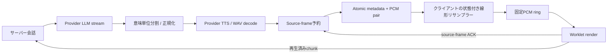

# アーキテクチャ

[English](architecture.md) | 日本語 · [README](../README.ja.md)

起動プログラムが`internal/engine`のTTS registry、`internal/transport/http`の公開API、各providerと独立したrealtime状態機械を接続します。Goパッケージは`internal/`にあり、安定した外部接続境界はPublic API v1とSDKです。外部import用のGo SDKではありません。

## 所有権とライフサイクル

| 所有者 | 責務と寿命 |
| --- | --- |
| Engine起動プログラム | .env読込、TTS／共有STT初期化、LLM／turn／相づち設定、loopback HTTP起動。signalでrootをcancelし、transportとproviderを終了 |
| HTTP transport | route、共通Origin／error／limit方針、最大64 WebSockets、socket単位の上限付きworker groupとatomic writer |
| Session | context／mutex、入力状態、1つのactive出力generation、割り込みtoken、先行生成候補、会話store |
| Generation | 新規ID／context、意味単位pipeline、source timeline、flow controller。置換時に旧処理をcancel |
| STT runtime | 通常要求と先行生成で共有する1 child／model／推論slot、受入上限、kill／wait／reload |
| Browser | 許可とdevice tracks、VAD、順序付きPCM／制御送信、AudioContext／Worklet、実render進捗、UIメモリ |
| Providers | interface越しの推論／変換。技術的に可能な範囲でcancelに従い、protocolや会話履歴を所有しない |

標準起動プログラムはAquesTalkのDLL呼び出しのためWindows専用です。provider未設定でも他のサービスは利用できます。Smart Turnの構築時検証はローカルURLの検証で、実際の準備完了確認ではありません。healthも推論しません。

## 入力・endpointing・文字起こし

`BrowserMicrophone`はブラウザにecho cancellation／noise suppression／automatic gainを要求します。注入式のSilero adapterが16 kHz floatを渡し、mono PCM16へ変換します。PCMとspeech_start/end/misfireは256 KiB上限の同じ順序付きqueueを通ります。サーバーがブラウザVADを実行したり独自AECを実装したりするわけではありません。

連続入力はpre-roll付きの上限バッファを保持します。VAD endはpossible_end／waitingへ進めますがcommitではありません。Smart Turn providerは直近8秒をloopbackサイドカーへ送り、最小／最大待機と最大発話時間でendpointingを制御します。発話再開時はrevisionで古い判定・STT結果を除外します。サイドカーは推論を直列化し、busyならnative処理をqueueせず拒否します。

manual入力は明示commitです。`/v1/transcription`は会話／LLM／TTSを作りません。両経路はSTT受入枠を共有します。常駐whisper-serverはモデルを再利用して確定結果を返しますが、逐次Whisperではありません。cancel／error時はworkerを終了・回収してから再ロードします。WindowsではJob Objectで封じ込めます。CUDA自動fallbackは文書化した初期化時／次要求時の方針に限定します。

## 会話と先行生成

サーバーが発行した入力contextがcommit判定を一度だけ通過します。会話storeはsystem指示、確定user turn、assistant itemを所有します。公開入力からsystem/developer roleは注入できません。応答ごとに新しいgeneration IDを作ります。

先行生成はendpoint確定前にsnapshot STTとLLM deltaのバッファリングを実行できます。turn ID／revision／speculation IDで管理し、TTS・transport・history書込の権限は与えません。1 worker/session、試行数・cooldown・時間・容量の上限、STTのnonblocking受入で増大を防ぎます。promotionには入力・context・割り込みの条件を満たす必要があり、その後にのみ正式text／PCMを公開します。失敗時は通常の確定経路へfallbackできます。観測イベント自体はbest effortで、commit判定の代替ではありません。

履歴は生成／送信した監査textと、実際に届けたcontextを区別します。音声の次回contextにはsource frameで再生確認できた意味単位chunk全体のみを含めます。text-onlyは送信textを使います。cancel済み、未再生、userを持たない提供応答を架空の会話にしません。上限時には古い完結した会話の組をまとめて除外します。

## 応答・PCM・再生

分割の既定soft/hard rune上限は30/60、channel容量は16 chunksです。正規化前の意味的な原文を履歴用に保持します。TTSはchunk単位に完全なWAVを返し、transportがdecodeしてPCMに分割します。PCM配信はAquesTalk内部の推論ストリーミングを意味しません。AquesTalk native呼び出しは同期処理で、Go contextでは強制中断できません。

credit-v1は累積capacity／received／played／buffered source framesを使います。受信は再生ではありません。writerはmetadata／binaryのatomic pairの前に予約し、credit待機中にlockを保持しません。制御イベントはaudio creditを消費しません。timeout／cancel／disconnectで待機を解除します。source PCM rateとAudioContext出力rateは別です。

SDKのcanonical Workletは固定ring（hard上限30秒）、4096 metadata descriptors、連続resampling位相、startup buffering（30ms）、rebuffering（10ms）、pause位置、generation／token照合を管理します。線形補間に帯域制限filterはありません。`generation.done`でtailをflushしますがspeaker完了ではありません。正確なsource-frame drainでサーバーの再生済み履歴を進めます。

## 割り込みと復帰

発話開始時にクライアントがPCMを保持したまま即時pauseします。サーバーはgeneration／interruption tokenが一致する判定を確定または復帰させます。復帰は同じ読取位置とassistant itemを再利用し、新しい会話turnを作りません。真の割り込みでは出力をcancelし、再生済みprefixだけを確定します。multisignalは音響・turn証拠と任意の意味的証拠を使う保守的ヒューリスティックで、学習済み日本語相づちモデルではありません。曖昧・失敗・timeoutには上限付きのcancel経路があります。古い判定で新generationを復帰させません。

## 並行性・cleanup・観測

Session状態はmutexで直列化し、provider処理はその外側で実行します。transportは最大16 workers/socketとwriter待機deadlineを持ちます。session closeは入力／generation／speculationをcancelし、共有2秒のcleanup枠で待ち、`cleanup_complete`を返します。cancelに従わない処理やnative呼出しは待機枠を超えて残る場合があります。server shutdownはhijack済みWebSocket contextも明示cancelします。

永続storeや再接続復元はありません。新しいsocketは新session／conversationです。protocol IDは非同期処理を相関し、client event IDは冪等キーではありません。公開errorはraw provider bodyや秘密を含めません。通常ログはstage／件数／ID中心ですが、ローカルTTS起動エラーはパス、サイドカー失敗はローカルtracebackを含む場合があります。

capabilitiesは設定／runtime状態でありremote到達保証ではありません。会話・先行生成の通知は上限付きbest effortなので、ブラウザのlatency結合が不完全になる場合があります。履歴はページメモリのみで、event間隔／PCM受信を測定します。TTS開始と可聴時間は未取得です。[性能](performance.ja.md)、[protocol](realtime-protocol.ja.md)、既存詳細：[input](realtime-input.md)、[interruption](interruption-recovery.md)、[speculation](speculative-generation.md)、[conversation](conversation-runtime.md)、[audio](audio-runtime.md)、[STT](stt-runtime.md)。
