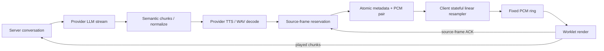

# Architecture

English | [日本語](architecture.ja.md) · [README](../README.md)

The executable wires `internal/engine` (TTS registry), `internal/transport/http` (public API), provider implementations and independent realtime state machines. The Go packages are under `internal/`; the stable integration boundary is Public API v1 and the SDKs, not an externally importable Go SDK.

## Ownership and lifecycle

| Owner | Responsibilities and lifetime |
| --- | --- |
| Engine entry point | Load .env, initialize TTS and shared STT runtime, configure LLM/turn/backchannel, start loopback HTTP; cancel root on signal, shut down transport, close providers |
| HTTP transport | Routes, common Origin/error/limit policy, at most 64 WebSockets; bounded per-socket worker group and atomic writer |
| Session | Context/mutex, input state, one active output generation, interruption token, speculation candidate, conversation store |
| Generation | Fresh ID/context, semantic pipeline, source timeline and flow controller; replacement cancels the old work |
| STT runtime | One child/model/inference slot shared by ordinary and speculative requests; bounded admission, kill/wait/reload |
| Browser | Permission/device tracks, VAD, ordered PCM/control sends, AudioContext/Worklet, actual render progress, UI memory |
| Providers | Inference/conversion behind interfaces; honor cancellation where technically possible; no ownership of protocol/history |

The entry point is Windows-specific because its AquesTalk adapter uses DLL calls. Missing provider configuration leaves other services available. Smart Turn construction validates a local URL, not live readiness. Health does not probe inference.

## Input, endpointing and transcription

`BrowserMicrophone` requests browser echo cancellation/noise suppression/automatic gain. The optional injected Silero adapter delivers 16 kHz floats, converted to mono PCM16. PCM and speech_start/end/misfire metadata use one ordered, 256 KiB bounded queue. The server does not run browser VAD or implement custom AEC.

Continuous input retains a bounded buffer with pre-roll. VAD end moves the server toward possible_end/waiting; it is not a commit. The Smart Turn provider sends the last eight seconds to the loopback sidecar. Min/max delays and maximum duration govern endpointing; revisions reject stale detector/STT results when speech resumes. The sidecar serializes inference and rejects busy requests rather than queuing native work.

Manual input commits explicitly; `/v1/transcription` never creates conversation/LLM/TTS. Both paths share STT admission. Persistent whisper-server loads once and produces final-only transcription; it is not streaming incremental Whisper. Cancelled/error workers are killed and reaped before reuse/reload, including Windows Job Object containment. Automatic CUDA fallback is limited to the documented initialization/next-request policy.

## Conversation and speculation

Server-issued input contexts cross the commit barrier once. The conversation store owns the system instruction, committed user turn and assistant item. Public input cannot inject system/developer roles. Each new conversation response gets a fresh generation ID.

Speculation can run snapshot STT then buffer LLM deltas before endpoint commit. Its capability contains turn ID/revision/speculation ID; it has no TTS/transport/history-write authority. One worker/session, attempt/cooldown/time/buffer bounds and nonblocking shared STT admission prevent speculative work from growing without bound. Promotion requires valid input, context and interruption barriers; only then may text/PCM become official output. Failure can fall back to the normal committed path. Telemetry is best effort, not the barrier itself.

The history store keeps generated/sent audit text separately from delivered context. Audio history includes only complete semantic chunks confirmed played in source frames. Text-only delivered text uses sent text. Cancelled, unplayed and orphan supplied-response output does not become a fictional spoken exchange. Old complete exchanges are evicted as groups under configured item/byte limits.

## Response, PCM and playback

Speech chunking defaults to soft/hard rune limits 30/60 with a 16-chunk channel. Normalization retains original semantic source text for history. TTS produces a complete WAV per chunk, then the transport decodes and splits PCM; PCM streaming does not imply streaming inference inside AquesTalk. Native AquesTalk calls are synchronous and cannot be forcibly preempted by a Go context.

Credit-v1 uses cumulative capacity/received/played/buffered source frames. Receipt is not playback. The writer reserves before an atomic metadata/binary pair; locks are not held across credit waits. Client controls never consume audio credit. Timeout/cancel/disconnect releases waiting producers. Source PCM rates and AudioContext output rates remain separate.

The canonical SDK Worklet owns a fixed ring (30-second hard bound), 4096 metadata descriptors, streaming resampling phase, startup buffering (default 30ms), rebuffering (10ms), pause position and generation/token checks. Linear interpolation has no band-limiting filter. `generation.done` flushes the tail but is not speaker completion; exact source-frame drain advances server played history.

## Interruption and recovery

Client speech onset pauses output immediately without discarding retained PCM. Server evaluates the matching generation/interruption token and confirms or recovers. Recovery resumes the same read position and assistant item; it creates no new conversation turn. True interruption cancels output and freezes only its played prefix. The multisignal policy is a conservative heuristic using acoustic/turn evidence and optional semantic evidence, not a trained Japanese backchannel classifier. Ambiguity/failure/timeouts have bounded cancellation paths. Stale decisions cannot resume a newer generation.

## Concurrency, cleanup and observability

Session state is serialized under its mutex; provider work runs outside it. The transport has at most 16 workers/socket and a shared writer admission deadline. Session close cancels input/generation/speculation and waits under a shared two-second cleanup budget, reporting `cleanup_complete`. Noncompliant/native work may outlive that wait. Whole-server shutdown cancels hijacked WebSocket contexts explicitly.

There is no durable store or reconnect restoration. A new socket gets a new session/conversation. Protocol IDs correlate asynchronous work; client event IDs are not idempotency keys. Typed public errors omit raw provider bodies/secrets. Normal server logs use stage/count/ID metadata, though local TTS startup errors can include paths and sidecar failures have local tracebacks.

Capabilities report configuration/runtime state rather than a guarantee of remote readiness. Conversation/speculation notifications are bounded best-effort metadata, so browser latency joins can be incomplete. Browser history is page-memory only and measures event intervals/PCM receipt; TTS start and audible latency are unavailable. See [performance](performance.md), [protocol](realtime-protocol.md), and the existing deep dives: [input](realtime-input.md), [interruption](interruption-recovery.md), [speculation](speculative-generation.md), [conversation](conversation-runtime.md), [audio](audio-runtime.md), [STT](stt-runtime.md).
