# Audio Runtime Finishing

Conversation Runtime / Multi-turn History の source-frame semantics を維持した音声ランタイム。2026-09-24 実装。
以下は指定された24項目の実装・検証報告である。

## 1. 変更ファイル

| ファイル | 変更 |
| --- | --- |
| `examples/browser/audio-worklet.js` | 固定リング、streaming resampler、scheduler、credit、数値metrics |
| `examples/browser/audio-worklet.test.cjs` | ring/resampling/lifecycle/長時間テスト |
| `examples/browser/realtime-test.html` | negotiation、source PCM転送、credit、done通知、in-flight上限 |
| `examples/browser/realtime-test.test.cjs` | browser–Worklet結合、互換性、overflow前のACK |
| `internal/audio/timeline.go` | source軸を明記、SentFrames=0もplayed上限として扱う |
| `internal/realtime/session.go` | generationごとのFlowController、session negotiation状態 |
| `internal/realtime/conversation.go` | legacy credit補充、write/ACK競合の再照合 |
| `internal/speech/pipeline.go` | 外部テキスト用の非ブロッキング投入・終了 |
| `internal/transport/http/realtime.go` | credit protocol、PCM予約、最終source数、WAV上限 |
| `docs/conversation-runtime.md` | 本工程へのリンク |

## 2. 新規ファイル

- `internal/audio/flow.go` / `flow_test.go`: source-frame credit window、待機と検証。
- `internal/realtime/audio.go` / `audio_test.go`: sessionとの接続、世代破棄、履歴の結合テスト。
- `internal/transport/http/audio_test.go`: 実WebSocketによるflow/atomic writer/controlテスト、TTS endpoint回帰。
- `docs/audio-runtime.md`: 本報告。

## 3. 変更前後のAudio flow

変更前: LLM → semantic chunk → normalize → AquesTalk → WAV decode → 無制御PCM write → browserでpacketごとにresample → Worklet配列queue → render。

変更後は以下。TTS Provider、STT、endpoint、speculationのcommit判定は変更していない。

```mermaid
flowchart LR
    LLM --> Chunk[Semantic Chunk / normalize]
    Chunk --> TTS[AquesTalk / WAV decode]
    TTS --> Reserve[Source frame credit reservation]
    Reserve --> Writer[Atomic metadata + binary write]
    Writer --> Browser[Bounded source PCM transfer]
    Browser --> SRC[Generation streaming resampler]
    SRC --> Ring[Fixed output PCM ring]
    Ring --> Render[Worklet render]
    Render --> Credit[Source frame progress / credit]
    Credit --> Reserve
    Credit --> Timeline[Source Playback Timeline]
    Timeline --> History[Played semantic chunk history]
```



## 4. Ring Buffer設計

`PCMFrameRing`は一度確保した`Float32Array`、read/write index、used/freeを持つ。書き込み・読み込みでindexを容量moduloに進め、未再生領域は上書きしない。render中にshift/slice/concatやPCM配列確保を行わない。出力channelの配列はAudioWorkletから渡されたものを使う。

generation作成・cancel時はindex/countだけをresetする。全サンプルをゼロクリアしなくてもused=0以降の古い領域は読まれない。capacity判定には、まだ生成していないresampler末尾も含む最終output frame数を使う。

## 5. metadata構造

PCMとは別に4096件固定の`Float64Array sourceEnd`と`Int32Array chunkSequence / packetSequence`を持つ。再生済みsource境界に達したdescriptorを順に解放する。metadataだけ大量に投入しても上限超過で停止する。

active generation、source/output rate、累積input/output/played frames、paused/token、done/completedは世代単位で保持する。source rate変更、source offset不一致、packet/chunk順序不一致はterminal failure。旧generationのaudio/done/pause/resume/clearは現generationへ作用しない。

## 6. Resampler方式と調査

generation全体で位相と直前source sampleを保持する線形補間を採用した。次のoutput index `k` の位置は `k * sourceRate / outputRate`。補間に必要な次sampleが未着なら保留し、次packet/chunkの最初のsampleで続ける。generation.done時だけ最後のsampleを保持してtailをflushする。generation変更・cancelはstateをresetする。

調査した候補は以下。サイズは2026-09-24にリンク先の配布JSを取得し、非圧縮byte数とPython gzipによる圧縮byte数を測った値。アプリ全体のbundle sizeや実通信サイズではない。

| 候補 | ライセンス / Worklet | 配布物サイズ | 採否 |
| --- | --- | --- | --- |
| [libsamplerate-js](https://github.com/aolsenjazz/libsamplerate-js) | [wrapper MIT / native BSD-2-Clause](https://github.com/aolsenjazz/libsamplerate-js/blob/main/LICENSE.md)。公式READMEにWorklet専用bundleとstreaming full APIあり | [dist/libsamplerate.worklet.js](https://github.com/aolsenjazz/libsamplerate-js/blob/main/dist/libsamplerate.worklet.js): 2,016,428 bytes / gzip 1,470,590 bytes | 高品質SRCを使う価値はあるが、現サンプルに約2MBのWASM配布物と非同期初期化を追加するため今回は不採用 |
| [wave-resampler](https://github.com/rochars/wave-resampler) | [MIT](https://github.com/rochars/wave-resampler/blob/master/LICENSE)、純JS。DOM依存のない計算処理だが専用Worklet/streaming APIはない | [dist/wave-resampler.js](https://github.com/rochars/wave-resampler/blob/master/dist/wave-resampler.js): 3,616 bytes / gzip 1,483 bytes | [実装](https://github.com/rochars/wave-resampler/blob/master/index.js)は呼び出しごとに出力配列・補間/filter stateを作り直す。今回必要な連続stateをそのまま満たさない |

追加依存はない。独自linearは帯域制限filterを持たないため、特にdownsamplingの音質には限界がある。計数・連続性はテストしたが、sinc相当の品質を達成したとはしていない。

## 7. source/output frame accounting

| 軸 | 使用場所 |
| --- | --- |
| source PCM frames / source rate | server Timeline、chunk StartFrame/EndFrame、credit、Conversation、`played_source_frames` |
| output frames / AudioContext rate | Worklet ring、rendered frames、output buffering、resampler出力 |

N source framesの最終output数は`ceil(N * outputRate / sourceRate)`をgeneration累積値から計算する。packetごとのroundはない。再生途中は`min(N, floor(playedOutput * sourceRate / outputRate))`を報告する。done + ring empty時は厳密にNへ到達する。整数積がJavaScript安全整数範囲を超えるgenerationは受け付けない。

`generation.done.data.source_frames`と受信済み累積値が違えば完了扱いにしない。旧serverでこの値がない場合は受信数を使う。mono PCM16のsource frameは1 sampleだが、source/outputの二つの軸は同率でも区別する。

## 8. Scheduler

generation状態（active / generating / done）、playback状態（starting / playing / paused / completed）、buffer状態（buffered / empty / underrun）を別々に管理する。cancelはactive generationと未再生領域を破棄する。巨大な共通enumは追加していない。

pauseはread positionとresampler stateを保持し、出力は無音、playedは不変。容量内なら同generationのPCMを受信できる。resumeはgenerationとinterruption token両方の一致が必要。doneがpause中に到着してもtailを保存し、resume後に続きだけを再生する。

## 9. Startup buffering

`AudioWorkletNode`の`processorOptions.startupBufferMs`で設定する。既定30ms、許容0〜100ms。underrun後の再開には`lowWatermarkMs`を使い、既定10ms、許容0〜100ms。generation.done後は閾値未満でも残音声をdrainする。数秒のstartup待ちは設けていない。

既定値は実測による最適値ではない。端末・TTS・ネットワークの測定結果に応じて変更できる。例えば`processorOptions: {startupBufferMs: 40, lowWatermarkMs: 15}`をnode作成時に指定する。

## 10. Underrun / drain / completion

生成中の一時的空バッファは`playback.underrun`（Worklet→mainのローカル通知）。無音をrenderしてもplayedを増やさない。連続した不足期間は1回として数え、rebuffering閾値まで待つ。pause/cancel後をunderrunとして数えない。

`generation.done`はTTS/送信pipeline終了でありspeaker完了ではない。Workletではdone、tail flush、ring empty、exact source totalを満たして初めて`playback.completed`を出す。serverへは通常のsource progress/creditを送る。新しいcompletedイベントをConversationの別確定条件として持ち込まず、従来のAudioDone + semantic chunks played判定を維持する。

## 11. Flow Control protocol

serverの`session.created.data.audio_flow_control = "credit-v1"`を見たclientは、generation作成前に次を送る。

```json
{"type":"playback.configure","data":{"flow_control":"credit-v1"}}
```

このsessionのgenerationは初期credit=0。serverはPCM前に`response.audio.chunk.started`でsource formatを通知する。clientはWorkletへformatを渡し、PCM未着の段階で初期capacityを送れる。

```json
{"type":"playback.credit","generation_id":"gen_example","data":{"capacity_source_frames":16000,"received_source_frames":8000,"played_source_frames":4000,"buffered_source_frames":4000}}
```

これは8000Hzならcapacity 2秒、受信1秒、再生0.5秒、保持0.5秒のsnapshot。`available`を加算するgrant方式ではない。すべてsource frame軸で、buffered=received-played、0≤played≤received≤server予約済みを検証する。capacityはsource rateの100ms〜30秒。gen IDが古ければ無視する。

`response.audio.delta`には従来のformat/sequence/bytesに加え`source_frames`とgeneration累積`source_start_frame`が付く。metadata直後のbinaryが対応PCMである。

## 12. Credit algorithm

送信可能数は`max(0, played + capacity - reserved)`。reservedはsocketへ渡す前に予約する累積source frame数で、ネットワーク、browser main、MessagePort、Workletにある全未確認データを含む。receivedだけが増えても追加creditにならない。pausedでplayedが止まれば、windowを満たした時点でproducerも止まる。

audio packetは16KiB以下かつavailable以下に分割する。小さいwindowでも巨大packetを丸ごと待って詰まらない。重複snapshotはcreditを増やさず、古いreceived/played snapshotは無視する。明示credit modeに入った後はlegacy progressでcreditを二重補充しない。

## 13. Cancellation / deadlock対策

Reserveはgeneration context cancel、session/disconnect cancel、30秒timeoutで解除される。generation変更では旧contextをcancelして新FlowControllerを作る。通知待ち中はFlowController mutexも保持しない。Session lockはcontrollerの取得・短い状態更新だけに使い、writer lock取得はReserve完了後。

credit待機でTTS消費が止まると、通常LLM goroutineは16件のspeech channelで自然に待つ。一方、WebSocket readerで外部`response.text.delta/done`を処理する経路は`TryPush/TryClose`に変更した。上限超過時は`text_backpressure`でgenerationを打ち切り、readerがcredit/cancelを読めなくなる循環待ちを防ぐ。text-onlyには音声待機を導入していない。

## 14. realtimeWriterとの関係

既存`AudioDelta`のmutexでmetadataとbinaryの連続writeを維持する。credit待機はこのmutexの外。control、ping/pong、interruption、generation.cancelはcreditを消費しない。実WebSocketで100組のPCMと100件のcontrolを並行送信して対応を検証した。

ネットワーク自体が詰まった時のWebSocket単一接続のwrite待ちは残る。creditがcontrolをブロックしないことと、ネットワーク遅延ゼロは別の保証である。

## 15. Timeline integration

Generated/Sent/PlayedFrames、SampleRateはすべてsource PCMのまま。source ACKを優先し、legacy secondsはsource rateへ換算する。playedは単調かつsent以下（sent=0を含む）。pauseは値を破棄しない。

socket writeをclientが受け取ってから`RecordAudioSent`がSession lockを取るまでの間にACKが来る競合も処理する。FlowControllerの確認位置を保持し、write完了記録時にsentとのminを再照合する。source軸の最後のACKをこの競合で失わない。

## 16. Conversation Runtimeへの影響

chunkのsource StartFrame/EndFrame、元semantic text、生成本文と送信本文の区別は変更しない。creditに含まれるplayed位置はTimeline経由で同じchunk判定へ入る。単なるreceiptやgeneration.doneは再生確認にならない。

true interruptionではcancel直前に確認済みの完全なsemantic chunkだけを次回LLM contextへ入れる。部分再生chunkの残りや生成全文は入れない。source offsetの古いcreditが履歴を進めないことも検証した。completed / interrupted / cancelled、text-only、multi-turnの既存テストは継続する。

## 17. Backchannel / interruptionへの影響

相槌・誤割り込みは同generation、同Assistant Item、同read positionからresumeする。ringやresamplerをresetしない。true interruption、overflow、watchdog failureは既存のserver判断・cancel経路を使う。overflow発生時にはその時点のrendered source prefixをprogressで送ってからoverflowを送る。

VAD、SmartTurn、Dynamic Endpointing、相槌判定policyは変更していない。pause中に送信がcredit待ちでも、cancel/新generation/disconnectによる解除をテストしている。

## 18. Resource limits

| 対象 | 上限 |
| --- | --- |
| Worklet PCM | 既定・最大30秒分のFloat32 mono。48kHzで5,760,000 bytes。node作成時capacityMsで200〜30000msに変更可 |
| metadata | 固定4096 descriptors、typed array合計65,536 bytes |
| network credit window | browser既定2秒。小さいringではtail余裕を引いてさらに縮小 |
| MessagePort backlog | main側でも累積source送信−確認playedを30秒で制限。credit modeでは通常2秒以内 |
| source rate | 1000〜192000Hz。mono PCM16。世代途中のformat変更は不可 |
| WAV | realtime synthesisの1 semantic chunkあたり16MiBまで読み込む。decode時PCM copyとReadAll一時領域は別途必要だが入力上限で有限 |
| speech channel | 16 semantic chunks。音声送信workerは1 generationで直列 |
| credit wait | 1回の連続待機30秒まで。context cancelで即解除 |

stereo対応は今回追加していない。rateを8kHzに固定する設計にはしていない。generationを超えてaudio/metadataを蓄積するコレクションはない。

## 19. Observability

`window.audioRuntimeMetrics`に最新のWorklet snapshotを保持する。本文・PCMは含まない。

| 指標 | 意味 |
| --- | --- |
| buffered_ms / max_buffered_ms | output ring保持時間 / generation内最大（tail予約を含む最大値） |
| startup_buffer_ms / low_watermark_ms | 現在の設定 |
| underrun_count / overflow_count | 不足期間数 / terminal buffer・metadata failure数 |
| playback_start_latency_ms | generation受信から最初のrender quantumまで |
| drain_latency_ms | generation.done受信からdrain確認まで |
| resample_input_frames / resample_output_frames | source入力数 / resampling出力数 |
| generation_playback_duration_ms | 最初のrenderから完了まで（pauseを含む） |
| credit_wait_ms / credit_wait_count | serverの`audio flow`ログ、generation累積の待機時間と回数 |

browserの時間はAudioContext render clockを基準とし、端末の物理出音時刻ではない。metrics通知はprogress（約50msの消費量ごと）、receipt、pause、underrun、completion等で更新する。credit待機時間は待機終了時に集計し、chunk終了/cancel時にログへ出す。

## 20. Legacy fallback

negotiationをしないclientには2秒の初期windowを与え、既存playback.progressで再生分だけ補充する。ACKを送らないclientは2秒を超えて送り続けず、待機timeoutでgenerationを終了する。短い音声、text-only、通常TTS endpointはcreditなしでも使える。

新browserが旧serverへ接続した場合はcapabilityがないのでconfigure/creditを送らず、既存progressを送る。旧serverからの大量PCMは30秒のmain/Worklet上限で停止する。無制限送信を許すfallbackは追加していない。

## 21. Testsと結果

`gofmt`、`go test ./...`、関連パッケージの`go vet`、`node --test examples/browser/*.test.cjs`を実施。Nodeは25テストが通過。Goの既存Conversation/Speculation/Input/Interruption等も含めて通過した。

全体`go vet ./...`は既存`internal/providers/tts/aquestalk/provider_windows.go:324`の`possible misuse of unsafe.Pointer`で失敗する。関連audio/realtime/speech/conversation/httpのvetは通過。`go test -race`は`CGO_ENABLED=0`のため起動できず、race detector通過を主張しない。

要求された35項目との対応は以下。

| 要求番号 | 検証 |
| --- | --- |
| 1〜3 | Worklet ring 100,000回のwrap/full/empty、full時のno overwrite |
| 4〜9 | 世代交代、旧packet、pause保持、同位置resume、対象cancel、旧token拒否 |
| 10〜13 | 4 rate組のbatch/分割波形一致、source/output数、10分相当8k→44.1k、exact final total |
| 14〜17 | startup 30ms、low watermark、underrun継続、done+drain、PCM/metadata overflow |
| 18〜19 | FlowController初期credit=0のblock、追加creditでresume、重複snapshot |
| 20〜21 | Session cancel/disconnectの待機解除、FlowController timeout |
| 22 | 実WebSocketのcredit待ち中ping/pong、generation.cancel、外部text過剰投入 |
| 23 | 実PCM bytes/source offset検証、並行controlとのmetadata/binary atomicity |
| 24〜25 | paused credit保持、Session pause中cancel/replace/close、新generationの別controller |
| 26 | Timeline単調性、pause位置、source duration、ACK/write競合 |
| 27〜28 | credit→semantic chunk→interrupted context、未再生chunk除外、旧credit拒否 |
| 29〜30 | 既存TwoPhaseInterruption / Conversation recovery / true interruption回帰 |
| 31〜33 | 既存Speculation全体、ConversationWireMultiTurnのtext/legacy/speculation |
| 34 | `/v1/audio/speech` WAV形式・source rate・PCM、既存health |
| 35 | 旧clientの2秒上限、progress補充、credit不要の短音声、旧server向けbrowser |

10分試験は実時間10分の聴取ではなく、4,800,000 source framesを小packetで投入し、26,460,000 output framesを模擬renderする計数・連続処理試験。実機の音切れやGC jitter測定とは区別する。

## 22. 実機確認が必要な項目

1. engineとbrowser sampleを起動しStart Audio後に会話する。44.1kHz/48kHz端末で音声末尾とchunk境界を聴取する。
2. 短い相槌でpause→resumeし、同じ箇所の重複再生・先頭からの再生がないことを確認する。
3. 長い応答中に割り込み、次ターンのcontextへ未再生semantic chunkが入らないことをmetadata/履歴で確認する。
4. CPU負荷とネットワーク遅延を加えてunderrun、startup latency、max buffered、credit waitを比較する。
5. タブ背景化、AudioContext suspend/resume、音声デバイス変更、長いpause後のtimeoutを確認する。

今回はマイク/物理スピーカー/実AquesTalk/OpenAIを通す聴取試験と音質・latency benchmarkは未実施。自動テストはmock TTS、実WebSocket、VM Workletで行った。

## 23. 既知の問題・制限

- 線形補間にanti-alias filterはない。異なるrateには対応するがdownsamplingの音質保証はない。
- playedはrenderへの出力確認であり、物理機器の出音や利用者が聞いたことの保証ではない。
- browser metricsはAudioContext clockで、suspend中の壁時計時間を含まない。
- 長時間pause/遅いclientは30秒のcredit待機timeoutでcancelされる。pauseの無期限保持はしない。
- buffer/watermark既定値は未最適化。実機GC/スケジューリング評価が必要。
- 外部text producerがbounded speech queueを超えるとそのgenerationを終了する。自動再送はない。
- 全体vetの既存警告とrace detector未実行は上記の通り。

## 24. 次工程への影響

Audio Runtimeの入力境界は、正式generationに属するformat付きsource PCMである。別sample rateのTTSや将来のcommit済みPCM artifactも、この境界へ順序付きsource framesとして渡せる。metadataとPCMのgeneration整合性、source total、creditを満たすことが条件になる。

Speculative TTSは未実装のまま。precommit generation/audioを作る経路は追加していない。Whisper最適化、Streaming STT、WebRTC、AEC、DB、reconnect、SDK、CLIは本工程に含めていない。

git commit / git pushは実行していない。
