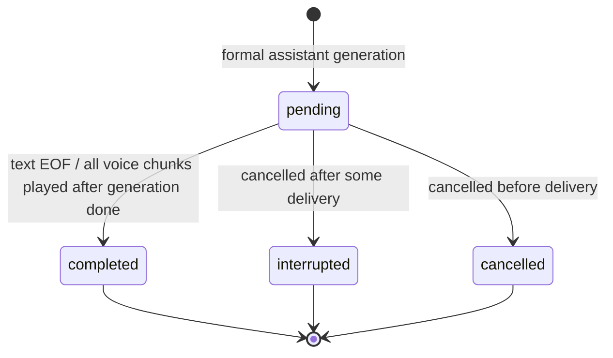

# Conversation Runtime / Multi-turn History

2026-09-24 実装報告。Session が独立した Conversation Runtime を所有し、正式な入力と
正式 generation だけを記録する。LLM 用 context は保存状態とは別に構築し、音声応答では
**再生確認済み semantic chunk のみ**を次の応答の前提にする。

## 1. 変更ファイル

- `internal/realtime/session.go` — Conversation 所有、入力 context と turn の対応、世代終了時の確定。
- `internal/realtime/input.go` — endpoint commit に対応する正式入力 context の登録。
- `internal/realtime/interruption.go` — pause 時の再生確認を履歴追跡にも反映。
- `internal/realtime/speculation.go` — speculative context snapshot、昇格時の一度限りの User commit、履歴再検証。
- `internal/realtime/event.go` — output mode と元 PCM frame 数の任意フィールド。
- `internal/speech/pipeline.go` — 正規化前の semantic source text を Chunk に保持。
- `internal/providers/llm/openai/provider.go` — Provider 固有の固定 system instructions を Conversation 側へ移動。
- `internal/providers/llm/openai/provider_test.go` — system override と複数 role の request serialization 試験。
- `internal/transport/http/server.go` — trusted server-side ConversationConfig。
- `internal/transport/http/realtime.go` — 会話履歴付き LLM request、正式 delta の記録、再生範囲登録、本文ログ削除。
- `internal/transport/http/speculation.go` — 採用済み stream、履歴変更時の通常 LLM 再実行、履歴付き retry。
- `internal/transport/http/input_test.go` — 先頭 system message を含む request の確認。
- `examples/browser/audio-worklet.js` — 元 PCM の再生位置追跡と queue drain 時の最終通知。
- `examples/browser/realtime-test.html` — 元 frame 数の受け渡し、通常 EVENT ログから本文を除外。
- `examples/browser/audio-worklet.test.cjs` — 部分再生／完全再生の source frame 試験。
- `examples/browser/realtime-test.test.cjs` — resampling 前の frame 数を保持する試験。
- `docs/realtime-input.md`、`docs/interruption-recovery.md`、`docs/speculative-generation.md` — この工程へのリンク。

## 2. 新規ファイル

- `internal/conversation/runtime.go`
- `internal/conversation/runtime_test.go`
- `internal/realtime/conversation.go`
- `internal/realtime/conversation_test.go`
- `internal/transport/http/conversation.go`
- `internal/transport/http/conversation_test.go`
- `internal/speech/pipeline_test.go`
- `docs/conversation-runtime.md`

## 3. Conversation data model

`conversation.Runtime` が `MemoryStore` と設定を所有する。外部 Provider や HTTP の型に依存しない。
`Item` は ID、Role、Content、SentText、TurnID、GenerationID、Status、CreatedAt、
TextOnly、LLMDone、AudioDone、Chunks、GeneratedFrames / SentFrames / PlayedFrames を持つ。
Role は string 型の user / assistant / system。将来の role や typed content 追加を妨げない。

Content は正式生成された原文、SentText は text 送信済み部分、Chunks は音声との対応であり、
Content の全文をそのまま「伝達済み」とは見なさない。
Store には正式 generation の進行中 Item もあるが、次回 context に入る Assistant は
completed / interrupted の伝達確認済み部分だけである。speculative content は Store に入らない。

## 4. Item lifecycle

User と system は committed。Assistant は正式 generation 作成時に pending となる。



終端 Item は再 finalization、遅い delta、遅い playback で変更しない。
Generation done、Turn complete、Conversation completed はそれぞれ別の状態である。

## 5. Conversation ID と Session ID

`conv_*` と `sess_*` は別々に生成する。現在は 1 WebSocket Session : 1 Conversation。
`session.created.data.conversation_id` で通知し、Conversation metadata にも含める。
`Snapshot.ID` は transport の ID に依存しない。再接続による復元や任意 ID への参加 API は今回ない。

## 6. User Item commit

Realtime は endpoint commit → STT final、legacy は input_audio.commit → STT final の後、
Session が登録した入力 context と turn ID を照合して User Item を追加する。
`beginConversationResponseLocked` が User commit、Assistant 作成、request snapshot を直列化する。
入力 context は一度だけ消費でき、通常 STT と speculative promotion の競合でも重複しない。
空・空白のみの transcript は Item にしない。キャンセル済み context、旧 turn、無効な UTF-8、上限超過を拒否する。

確定して記録された User Item は、後で応答生成が失敗した場合にも残る。
input cancel/stop が排除するのは、その時点でまだ正式に採用されていない入力である。

## 7. Assistant Item lifecycle

正式 generation ID ごとに一つの pending Item を作る。LLM delta を受け取った時点で Content、
text writer が成功した時点で SentText を更新する。TTS は元の semantic text と audio frame 範囲を追加する。
LLM EOF と音声生成終了を別のフラグで保持し、再生確認が揃うまで音声 Item は pending のままにする。
source text の読み変換・AqKanji2Koe の結果を LLM history に戻すことはない。

## 8. Playback-aware history

既存 PlaybackTimeline の generated / sent / played を Session lock 下で Conversation に反映する。
Item に frame 進捗も保持するため、新 generation の Timeline に置き換わった後も旧応答の区別が残る。
再生済みとする条件は **sent >= chunk.EndFrame かつ played >= chunk.EndFrame**。
連続して完全再生された chunk の source text だけを連結する。
日本語文字列を PCM 時間や文字数の比率で途中切断する処理はない。

## 9. Semantic Chunk と PCM Timeline

Chunk の識別子は親 Item の GenerationID と Sequence の組。各 Chunk は source Text、
StartFrame、EndFrame（半開区間）、SentFrames、Played を持つ。
TTS WAV を decode して正確な frame 数が得られた時点で登録し、送信成功分だけ sent を進める。
一つの generation 内で sample rate / channel 数が変わる音声は拒否し、frame 軸の意味を保つ。

ブラウザは各出力 PCM packet に元の `sourceFrames` を付けて Worklet へ渡す。
Worklet は packet 内の描画済み位置を保守的に source frame へ換算し、packet 全体を描画した時点では
元の整数 frame 数に正確に到達する。これにより 8kHz → 44.1kHz などの丸め誤差が累積しない。
これは PCM の sample-rate 対応であり、テキストの比例切断ではない。
queue が空になる最後の描画でも progress を強制通知する。

## 10. Interrupted Assistant policy

| 状況 | Status | 次回 LLM context |
|---|---|---|
| LLM EOF・音声生成完了・全 chunk 再生確認 | completed | 全 played semantic chunks |
| 途中まで再生して cancel / true interruption | interrupted | 完全再生済み chunk の連続 prefix のみ |
| 最初の chunk の途中だけ再生して中断 | interrupted | Assistant text は含めない |
| 再生前に cancel | cancelled | 含めない |
| text-only で EOF、全 text 送信成功 | completed | 送信済み text |
| text-only 途中 cancel | interrupted / cancelled | 送信済み text があればその部分のみ |

遅い playback acknowledgement で終端履歴を後から伸ばさない。聞いたか不明な末尾を含めるより、
確認済み範囲だけを使う保守的な policy である。

## 11. Context Builder

`conversation.Runtime.Context` が provider-neutral な `llm.Request{Messages: []llm.Message}` を作る。
system を先頭に置き、User と伝達済み Assistant を turn 単位でまとめる。
pending / cancelled Assistant と、User に対応しないクライアント供給 Assistant は context に含めない。
role / content の順序を維持し、OpenAI への変換は既存 Provider に任せる。
Claude / Gemini / local Provider は同じ request 境界に実装できる。

## 12. History / context limits

| 設定 | 既定値 |
|---|---|
| 保存 Item 数（system を含む） | 50 |
| 保存 text 合計（Content / SentText / chunk text） | 256 KiB |
| 一つの User/Assistant の text 領域ごとの上限 | 32 KiB |
| 一つの Assistant の chunk 数 | 1024 |
| LLM context の message 数（system を含む） | 20 |
| LLM context の content 合計 | 48 KiB |
| Conversation metadata queue | 64 件 |

すべて UTF-8 byte 数で、厳密な token 数ではない。保存と context の制限は別に適用する。
古い exchange から User / Assistant を一組で削除し、system と現在の exchange を維持する。
request 側でも exchange を分割せず、収まる最新の連続範囲を選ぶ。巨大な古い exchange を途中で切らない。
設定検証により、現在の User と Assistant の各領域を収容できる保存予算を必須にする。
generation ごとの request snapshot と speculative snapshot は、それぞれ context 上限内の追加領域である。
将来 tokenizer を導入する場合は Context の選択 budget を差し替えられる。

## 13. System prompt

既存 OpenAI Provider にあった日本語の既定指示を `conversation.DefaultSystemPrompt` へ移した。
全 Provider に同じ system message が渡り、OpenAI 固定 instructions が override を上書きしない。
trusted な server-side 設定だけで変更できる。

```go
cfg := conversation.DefaultConfig()
cfg.SystemPrompt = "アプリケーションが管理する指示"
if err := server.SetConversationConfig(cfg); err != nil {
    return err
}
// 個別 Session を所有するアプリでは NewSessionWithConversation(parent, cfg)。
```

Server の設定は接続開始前に行う。公開 WebSocket から system/developer prompt を設定する機能はない。
`input_text.commit` は text / output 以外のフィールドを拒否し、本文は常に user role にする。

## 14. Speculation integration

speculative STT は Store に書かない。speculative LLM は確定済み context の snapshot に
candidate user text を読み取り専用で加えて開始する。delta は従来の内部 buffer にだけ保持する。
promotion で正式 User Item を一度 commit し、Assistant Item を作り、その後の正式消費処理から記録する。
invalidated speculation は Conversation に Item を残さない。

**昇格時には LLM request の role/content 配列も比較する。** 先行処理の間に前応答の再生完了や
割り込み確定が起き、安全な履歴が変わった場合は、先行 LLM の buffer / stream を cancel する。
有効な STT final はそのまま再利用し、確定した新しい history で通常 LLM を開始する。
`speculation.fallback` の reason は `conversation_changed`。
通常の採用と最初の delta 前の retry も、同じ正式 request snapshot を使う。

## 15. Backchannel / false interruption

相槌 metadata を User Item に変換しない。VAD misfire、回復した入力、cancelled input も Item にしない。
false interruption は generation を cancel しないため、同じ pending Assistant Item と Timeline を継続する。
true interruption は旧 Assistant を playback-aware finalize してから新ターンを commit する。
履歴更新と次の request snapshot は同じ Session lock によって順序を保証する。

## 16. Text-only handling

従来の `generation.create` + client supplied `response.text.delta/done` は既定の音声合成経路を維持する。
`generation.create.data.output="text"` なら TTS と Timeline を使わず、クライアントが既に持つ text を記録する。
この経路は User を作らないため、単独の Assistant 入力を会話文脈へ混入させない。

LLM と複数ターン会話する text-only 入力には、以下のイベントを追加した。

```json
{"type":"input_text.commit","data":{"text":"札幌について教えて","output":"text"}}
{"type":"input_text.commit","data":{"text":"では明日は？","output":"text"}}
```

output は省略時 text、audio も選べる。TTS 無しで `response.text.delta/done` と `generation.done` を受け取れる。
マイク入力中との混在は拒否するため、ブラウザでは先に microphone を stop する。
text-only の正常 EOF は、送信確認済み全文と生成全文が一致する場合に completed とする。

## 17. Protocol / observability / privacy

- `session.created.data.conversation_id` を追加。
- `conversation.item.updated` を追加。作成と終端 status を同じイベント形式で通知する。
- Item ID、conversation / turn / generation ID、role、status、byte 数、frame 数、played chunk 数だけを含める。
- `input_audio.transcript.final.data.turn_id` を追加。User metadata と関連付けられる。
- `input_text.commit` と `generation.create.data.output` を追加。
- `playback.progress` / `playback.paused` に任意の `played_source_frames` を追加。未指定なら従来の seconds を使う。

本文は従来の transcript / response.text イベントだけで送る。Conversation metadata は非同期・best effort なので、
それらとの到着順には依存せず ID で関連付ける。queue 満杯では metadata を捨て、会話を停止しない。
本文入り Conversation snapshot を公開 WebSocket で取得する API は追加していない。
Engine の通常 STT / LLM / chunk ログとブラウザの EVENT / PCM 開始ログから本文を除外した。
Provider の STT/LLM failure 本文も通常ログへ転記しない。通常のコンテンツ配信自体は維持する。

## 18. Concurrency / idempotency

Runtime / MemoryStore は Session が直列化する owner-managed な設計。
turn/context の照合、User commit、Assistant 作成、履歴 finalization、request snapshot 作成を同じ lock で行う。
生成 delta、音声範囲登録、送信進捗、playback、cancel も generation ID を再検証する。
Provider 呼び出し、TTS、WebSocket write、stream Recv は lock 外。
Snapshot は chunk 配列もコピーし、外部変更を Store へ反映させない。
終端 Item の finalize と generation.done は重複呼び出しで再確定しない。
disconnect は active generation を確定・cancel し、遅い結果を拒否する。

## 19. Tests と結果

- `go test ./...` — 成功。
- Conversation / Semantic 対象テストの 5 回反復 — 成功。
- `go vet ./internal/conversation ./internal/realtime ./internal/transport/http ./internal/audio ./internal/speech ./internal/providers/llm/...` — 成功。
- `node --test examples/browser/audio-worklet.test.cjs examples/browser/realtime-test.test.cjs` — 13 件成功。
- `node --check examples/browser/audio-worklet.js` — 成功。
- `git -c core.whitespace=cr-at-eol diff --check` — 成功。
- `go test -race` — CGO 無効のため実行不可。並行 delta/finalize/cancel と反復試験を実施。
- `go vet ./...` — 既存 AquesTalk `provider_windows.go:324` の unsafe.Pointer 警告が残る。

通常 STT、legacy、speculative promotion、text-only の複数ターン request を直接検証する。
加えて、重複 User commit、確定前の履歴不変、無効化した speculation、先行中の履歴変更、
chunk 完全／部分／未再生、generation done と再生完了、旧 generation / turn、冪等 finalize、
相槌・false interruption・VAD misfire・true interruption、cancelled input、disconnect、
system 保持、item/byte/context 上限、古い exchange の削除、source text 正規化、resampling を試験している。
既存 endpointing、回復、Speculation、health、TTS endpoint、text realtime の回帰試験も通過した。
OpenAI は localhost の request/stream fixture で検証し、実サービス API への会話送信は行っていない。
Python / Whisper の変更はない。

## 20. 実機確認

「札幌について」→「明日は」のような参照を含む複数ターン、短い相槌、誤検知、訂正を伴う割り込みを試す。
最初の semantic chunk 再生前／途中／完了後で割り込み、次の回答が未再生の情報を前提にしないか確認する。
44.1kHz / 48kHz の出力、Bluetooth 等の遅延、queue drain、長い応答、通信遅延も確認が必要。
`conversation.item.updated` の status と frame 数、`speculation.fallback` の conversation_changed を観測できる。
実際のマイク・スピーカー・OpenAI を通した会話品質と latency は今回未測定。

## 21. 将来の persistence

今回は bounded MemoryStore のみ。Store インターフェースや同期 DB callback は追加していない。
Runtime の `Snapshot` に独立 Conversation ID、Item ID、turn/generation、status と再生確認範囲が揃うため、
Session 外で immutable snapshot を application storage / SQLite / PostgreSQL 等へ保存する境界として使える。
導入時には Snapshot の version、認証・所有権、確定 Item の upsert、一意 turn/generation 制約、
restore 中の pending Item の扱いを追加する。DB I/O を Session mutex 内で行わない。
reconnect 復元やユーザー認証を実装済みとはしていない。

## 22. 既知の問題・制限

- played はクライアントの描画報告を信頼する。物理スピーカーの音量、実際の聴取、機器内部の遅延までは保証しない。
- 報告遅延や旧クライアントの seconds 丸めにより、実際に聞いた最後の chunk が保守的に除外されることがある。
- 最初の chunk の一部だけ聞いた場合、status は interrupted でも Assistant text は context に入らない。
- text 送信成功は WebSocket write 成功を意味し、画面表示済みの別 ACK はない。
- 応答の途中で text 上限を超えると generation を打ち切る。自動要約や token-based budget はない。
- 履歴変更で speculative LLM を破棄する場合、追加 LLM request と latency が発生する。STT は再利用する。
- 全履歴の独立保存 API、DB、reconnect、tool、RAG、Streaming STT、speculative TTS は未実装。
- 不適切な VAD／相槌判定、現 Whisper の遅さなど前工程の制限は継続する。
- race detector 未実行と既存 AquesTalk vet 警告が残る。

git commit / git push は実行していない。
