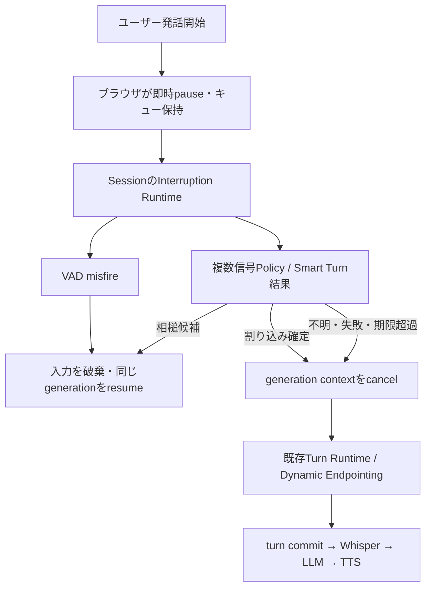
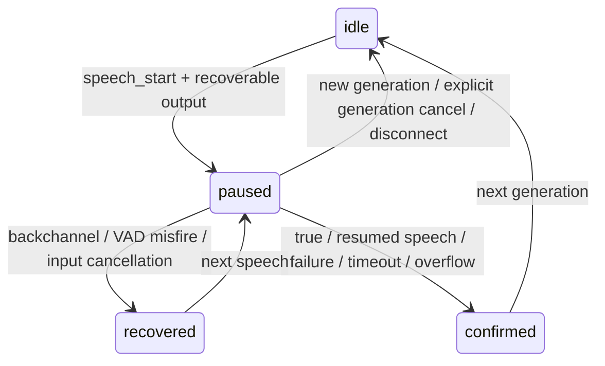

# Backchannel Detection / False-interruption Recovery

2026-09-24 実装報告。Smart Turn v3.2と既存の入力ターンRuntimeを維持し、その前段に、
出力の一時停止と割り込み確定を分ける処理を追加した。

## 旧フローと新フロー

旧：`speech_start → AudioWorklet.clear → generation.cancel → 通常入力ターン`。
音声キューとgeneration contextを破棄するため、相槌でも元の発話には戻れなかった。

新：`speech_start → 即時AudioWorklet.pause → Server判定 → resume または cancel`。



pauseはレンダリングの停止だけであり、LLM/TTSやgeneration contextをcancelしない。
cancelしたgenerationの復活、音声の再合成、先頭からの再送は行わない。
既存の明示的`generation.cancel`も引き続き利用できる。

## 候補モデルの調査と選択

適した研究・実装は存在する。今回は、依存サイズ・ライセンス・現状の遅いSTTを考慮し、
標準依存として採用できる、日本語・Windows CPUで検証済みの音声相槌モデルには至らなかった。
「既存モデルが存在しない」という結論ではない。

| 候補 | 日本語・入力・性能 | ライセンス／依存／Windows・単独利用 | 今回の判断 |
|---|---|---|---|
| MaAI BC-Det | 日本語、16kHz、mono/2ch、12.5Hz出力。CPU構成あり。12.5Hzは80ms間隔であり推論レイテンシの実測値ではない | コードMIT、公開日本語重みCC-BY-NC-ND-4.0。検出器の重み約17.4MBに加えMimi encoder、PyTorch、Transformers、GUI/audio等の依存。Windowsでのこの構成の動作・速度は未検証。SDK外でも利用可能な構造だが重みの条件確認が必要 | 非商用・改変禁止の重みをEngineの標準依存にはしない。将来の音声Provider候補 |
| MaAI/VAP BC timing | 日本語など。相槌を「いつ出すか」を予測 | PyTorch/VAP構成。BC-Detとは別のタスク | ユーザー発話の相槌分類器として代用しない |
| Easy Turn JA | 日本語4状態、約850M parameters。モデルカード記載P50 111.6ms、P95 291.2ms、VRAM peak 2.69GB。Windows CPUの測定値ではない | CC-BY-NC-SA-4.0。Whisper-Medium encoder、adapter、Qwen/WeNet構成。単独推論例あり。Windows CPU検証なし | 非商用条件と依存・実行条件が今回の標準構成に合わない |
| Japanese wav2vec2 backchannel CSJ | 94.6M parameters。日本語を標榜する音声分類モデル | 重みライセンス、評価、latency、Windows実績がモデルカード未記載。Transformers/PyTorch構成 | 利用条件と品質の裏付け不足 |
| backchannel-classifier 0.5.5 | 日本語ASRテキストを分類。小さなsklearnモデル。推論自体は軽量だがSTTが先に必要 | MIT、約75KB wheel＋NumPy/scikit-learn依存。Python単独利用可。Windowsで今回は未実行 | 現Whisperの最終結果を待つ設計になり、pauseのfast pathには使えない。将来Streaming STT導入時の候補 |

一次資料：

- [MaAI BC-Det仕様](https://github.com/MaAI-Kyoto/MaAI/blob/main/readme/bc_det.md)、[コードライセンス](https://github.com/MaAI-Kyoto/MaAI/blob/main/LICENSE)、[日本語重みライセンス](https://huggingface.co/maai-kyoto/bc_det_jp)、[依存一覧](https://github.com/MaAI-Kyoto/MaAI/blob/main/pyproject.toml)
- [VAP相槌タイミング予測](https://github.com/MaAI-Kyoto/MaAI/blob/main/readme/vap_bc.md)
- [Easy Turn JA model card](https://huggingface.co/ayousanz/easy-turn-ja)
- [wav2vec2 model card](https://huggingface.co/SiRoZaRuPa/japanese-wav2vec2-base-backchannel-CSJ)
- [backchannel-classifier 0.5.5](https://pypi.org/project/backchannel-classifier/0.5.5/)

前工程で保留したLiveKitへの置換は行っていない。Smart Turnは**発話終了検出専用**として維持し、
そのEOT確率を相槌確率として表示・解釈しない。今回モデル・Python依存の追加はない。

## 採用したPolicyと精度上の限界

境界は`internal/providers/backchannel.Provider`、標準実装は`multisignal.Policy`。
学習済み日本語相槌分類器ではなく、観測可能な複数信号を使う明示的なヒューリスティックである。

通常の音響相槌候補は、以下をすべて満たす場合だけ採用する。

- 回復可能な出力があり、Timeline上に未再生PCMがある。
- 1回の短い発話区間で、発話再開がなく、現在はVAD非発話状態。
- 観測PCMによる区間長120～550ms、1920 samples以上。VADのredemption区間も含むため、厳密な有声音長ではない。
- 終了後250ms以上の観測猶予がある。
- RMSが0.006～0.25、クリッピング率1%未満。
- Smart TurnがComplete、かつEOT確率0.85以上。

音声長だけ、相槌単語一覧だけ、RMSだけで決めない。RMS範囲・クリッピング検査は、
音響特徴を信頼できない入力で回復しないための保守的な条件で、咳やノイズの専用識別器ではない。
800ms以上の継続発話、途中からの発話再開、意味情報が示す訂正・要求はtrue interruption側に扱う。

**重要な制約：短い「いや」「違う」等が、相槌候補の音響条件とEOT条件を満たす可能性は残る。**
逆に長めの「なるほど」等を割り込み扱いすることもある。閾値は日本語実会話コーパスで校正していない。
実機で適合率・取りこぼしを測る必要がある。入力破棄を避けたい用途では
`BACKCHANNEL_ACOUSTIC_RECOVERY=false`にすると、意味情報がない曖昧入力は確定割り込みへfallbackする。
この設定でもVAD misfireの即時回復は有効。

`SupplyInterruptionSemantic(generation, turn, interruptionID, evidence)`は、将来の
サーバー側Streaming STT向けの任意入力境界。語彙候補に加え、区間長、非発話状態、EOT、
出力状態を確認し、利用可能な場合のみSTT confidenceを使う。confidence未提供はnil。
通常のWhisper finalを待つ処理や、追加のWhisperプロセスは起動していない。
現在の音声経路では意味情報は未供給。公開WebSocketから任意のtranscriptを注入するイベントもない。
遅れて到着した意味情報で、既に確定した判定を巻き戻すことはない。

## 状態と責務

Input Turn stateは従来の`idle / listening / speaking / possible_end / waiting / complete`。
Interruption stateは別に保持する。



生成の生存はgeneration context、送信完了は`generationDone`、再生位置・pauseはTimeline、
ブラウザの実再生停止はAudioWorkletが担当する。巨大な共通enumは作っていない。

Sessionの既存入力timer loopが判定期限も管理する。Smart Turnとclassifierは各セッション
最大1 workerずつ。推論やネットワーク処理はSession mutex外で行い、結果だけを適用する。

Smart TurnがCompleteでも、割り込み判定中はturn commitを保留する。相槌・誤検出なら
入力バッファを破棄し、STT/LLMを呼ばない。trueなら元の出力をcancelし、保留済みcommitを
再開する。まだ話している場合は入力を維持し、従来のDynamic Endpointingで終了を待つ。

## Playback recoveryとbounded buffer

AudioWorkletはpause時にqueue、queueOffset、playedFramesを保持する。
pause中も届く同じgenerationのPCMを末尾へ加えるが、processは無音を出し、playedFramesを増やさない。
resume時は保持したqueueOffsetから続ける。聞いた音声の再送・再生は行わない。

Timelineはgenerated/sent/playedに加え`Paused`と`PausePlayedFrames`を持つ。
Workletの`playback.paused`が、実際に停止したレンダリング位置をサーバーに報告する。
以前の`playback.progress`は引き続き単調増加の実再生量。
`BufferedFrames = SentFrames - PlayedFrames`で未再生量を参照する。

`generation.done`はTTS pipelineからすべて送信し終えたことを示す。再生完了やcancelではない。
pause直後にdoneになっても、未再生キューが残っていれば回復できる。

キュー上限は**30秒分のFloat32 mono PCM**。48kHzならsample storage約5.76MB。
Main threadでもposted−rendered framesを同じ上限に制限し、MessagePort転送待ちを含めて抑える。
Worklet側は部分消費済みの配列も、その配列が解放されるまで全長で保守的に数える。
配列・メッセージ管理のオーバーヘッドは上記sample storageとは別。

上限超過時はキュー全体をclearし、generation-awareな`playback.overflow`でサーバーに通知して
該当generationをcancelする。古い音声だけを落として途中から復旧したふりはしない。
この上限は非pause時にも有効なので、生成が実再生を30秒以上先行する長い出力もcancelされ得る。
将来は再生creditによるサーバーの送信backpressureへ発展可能。

## Protocol変更

全サーバーイベントは既存Envelopeの`session_id / generation_id / timestamp`を利用する。
判定イベントのdataは`interruption_id / turn_id / state / decision / reason / error / playback`。
判定IDはブラウザ発行の相関tokenであり、判定権限はSessionにある。

| イベント | 方向 | 意味 |
|---|---|---|
| `session.created` | S→C | `interruption_timeout_ms`を追加 |
| `input_audio.speech_start` | C→S | optional generation_id、data.interruption_id。ローカルpause直後に送信 |
| `interruption.suspected` | C→S | 既にユーザー発話中に新出力が届いた場合の相関通知 |
| `interruption.suspected` | S→C | サーバーが判定windowを開始 |
| `playback.paused` | C→S | generation/idとplayed_secondsによる実停止位置 |
| `interruption.recovered` | S→C | ID一致時のみ同じキューをresume |
| `input_audio.backchannel` | S→C | 相槌観測metadata。通常LLMターンにはしない |
| `interruption.confirmed` | S→C | 該当出力を正式cancelしたことを通知 |
| `generation.cancelled` | S→C | 従来イベントを併送。対応するキューをclear |
| `generation.done` | S→C | 音声送信pipeline完了。キューをclearしない |
| `playback.overflow` | C→S | 出力queue回復不能。そのgenerationだけcancel |
| `interruption.failed` | C→S | client watchdog。該当判定ID/generationをcancel |

`response.audio.delta`にはsample_rate/channels/bits_per_sampleも追加。
realtimeWriterがmetadataとbinary PCMを同一mutex区間で送信する。ブラウザは各binaryを
直前のdeltaのgenerationに結び付け、古いPCMを新generationとして扱わない。
古いクライアントは追加フィールドを無視でき、legacy input start/binary/commitと
明示的generation.cancelは維持。cancelにgeneration_idがある場合はstale IDを拒否する。

## 判定期限・失敗時の方針

`INTERRUPTION_DECISION_WINDOW`の既定値は**1500ms**、範囲300ms～5s。
起点は最初の割り込み疑いで、重複イベントによって延長しない。
ブラウザはサーバー期限＋1000msのwatchdogも持ち、応答欠落時にキューをclearして失敗通知する。

| ケース | 動作 |
|---|---|
| VAD misfire、元の有効入力なし | 元generationを維持しresume |
| true／発話再開 | cancel、音声を保持して既存ターン処理へ |
| ambiguous／classifier deadline／error／不正decision | cancel、入力を保持。勝手に相槌として破棄しない |
| Smart Turn失敗 | 既存のエラー通知とmax-delay fallback。割り込み側も期限内にcancelへ |
| queue overflow | cancel、該当出力PCMを破棄。ユーザー入力は維持 |
| input.cancel / stop | 判定を取り消し元出力をresume、入力を明示破棄 |
| LLM/TTS失敗 | 出力をID付きcancel。失敗generationを回復しない |
| disconnect | context cancel、timer停止、推論worker join、queue破棄 |

## Concurrency対策

- Session mutexで、入力状態、出力context、interruption ID・revisionの適用を直列化。
- 新generation／発話再開／誤検出／cancelで古いclassifier結果を無効化し、推論contextもcancel。
- generation+判定IDをサーバー、ブラウザ、Workletで照合。旧resumeは新キューに作用しない。
- generation completionはcontextをcancelせず、未再生PCMの回復を妨げない。
- ユーザー発話途中に新generationが出現した場合は、先行入力を相槌として破棄しない。
- TTS workerは開始時のgenerationに対応するTimelineだけを更新。
- paused/progressは既存の単調増加位置を保つ。古いgenerationの位置報告は無視。
- inputイベントとinterruptionイベントは同じbounded通知経路で既存writerへ渡す。
- 分類Providerにはキャンセル遵守が契約として必要。任意のキャンセル無視Go実装を強制終了はできない。

## 自動テストと結果

- `gofmt`：変更Goファイルに適用。
- `go test ./...`：成功。
- 対象パッケージ`go vet`：成功。
- `go vet ./...`：既存`internal/providers/tts/aquestalk/provider_windows.go:324`のunsafe.Pointer警告。
- `go test -race ...`：ホストのCGO/C compiler不足で実行不可。通常テストにconcurrent操作を含む。
- `node --test examples/browser/audio-worklet.test.cjs examples/browser/realtime-test.test.cjs`：11 tests成功。
- `node --check examples/browser/audio-worklet.js`：成功。HTML内JSもVMテストでparse/execution済み。
- 既存Python sidecar tests：3 tests成功。Pythonコード・依存は今回変更なし。

テスト対象：true interruption、short backchannel、VAD misfire、ambiguous timeout、
provider failure、generation.done while paused、stale resume、new generation while paused、
disconnect during classifier、repeat VAD、分類中の発話再開、PCM queue overflow、
MessagePort backlog上限、cancel/complete/progress同時操作、legacy input、Smart Turn契約・
Dynamic Endpointing、health、text generation、STT→LLM接続、TTS endpoint。
PCM/VAD/モデルのモックによる状態検証で、日本語音声の分類精度を証明するものではない。

## 実機確認手順

起動手順は[Realtime Input](realtime-input.md)を参照。既存Smart Turn sidecarが必要。
今回の設定例：

```powershell
$env:INTERRUPTION_DECISION_WINDOW = '1500ms'
$env:BACKCHANNEL_ACOUSTIC_RECOVERY = 'true'
go run ./cmd/engine
```

1. ブラウザでStart Audio→Start Microphone。AIに数文の回答を生成させる。
2. 再生中に短く「うん」。即時pause、`interruption.suspected`、条件を満たせば
   `interruption.recovered` / `input_audio.backchannel`、同じgenerationから音声再開を確認。
   `input_audio.transcript.final`や新しいLLM応答が出ないことも確認する。
3. 「いや東京の」と訂正。cancelと、その入力のSTT→新responseを確認。
   特に短い訂正が誤って相槌扱いされないかを複数回測定する。
4. 軽い咳・息・ノイズでVAD misfireを起こし、元の音声が未再生位置から戻ることを確認。
5. 音量、マイク、エコーキャンセル、発話者、相槌長を変えて誤判定を記録する。
6. Smart Turn sidecar停止・再起動、マイク停止、ページ切断で永久pauseがないことを確認。
7. 長い回答でbuffer上限到達時の`playback.overflow`とcancelを確認。

実マイク・スピーカー、OpenAIとAquesTalkを含む実音声会話での体感と精度は未検証。
分類用に録音を外部へ送信したり、新たなモデルをダウンロードしたりはしていない。

## 次工程への影響・既知の制約

相槌誤分類は入力破棄につながるので、運用前の日本語会話評価が必要。
現Policyは一時的な単語一致スタブではなく複数信号を利用するが、学習済み相槌モデルに
匹敵する精度は主張しない。高精度化はProvider差し替え、校正データ、Streaming STT証拠で行う。
false interruptionのうち、VADが有効音声と判定する咳・ノイズは必ず回復できるわけではない。

会話履歴には相槌を保存していないが、turn ID付きmetadataイベントを利用できる。
Whisper高速化、persistent model、Streaming STT本体、WebRTC、true ring bufferは未実装。
新しいSDKでは追加protocolとgeneration-aware pause tokenを維持すること。
将来モデルを導入する場合も、判定期限と入力保持fallbackはRuntimeに残す。

## ファイル一覧

変更：

- `cmd/engine/main.go`
- `examples/browser/audio-worklet.js`
- `examples/browser/realtime-test.html`
- `examples/browser/realtime-test.test.cjs`
- `internal/audio/timeline.go`
- `internal/realtime/event.go`
- `internal/realtime/input.go`
- `internal/realtime/session.go`
- `internal/transport/http/input.go`
- `internal/transport/http/realtime.go`
- `internal/transport/http/realtime_writer.go`
- `internal/transport/http/server.go`
- `docs/realtime-input.md`

新規：

- `internal/providers/backchannel/provider.go`
- `internal/providers/backchannel/multisignal/policy.go`
- `internal/providers/backchannel/multisignal/policy_test.go`
- `internal/realtime/interruption.go`
- `internal/realtime/interruption_test.go`
- `internal/transport/http/interruption.go`
- `internal/transport/http/interruption_test.go`
- `examples/browser/audio-worklet.test.cjs`
- `docs/interruption-recovery.md`

git commit / pushは実施していない。proprietary SDKやruntime/whisperは変更・追加していない。
