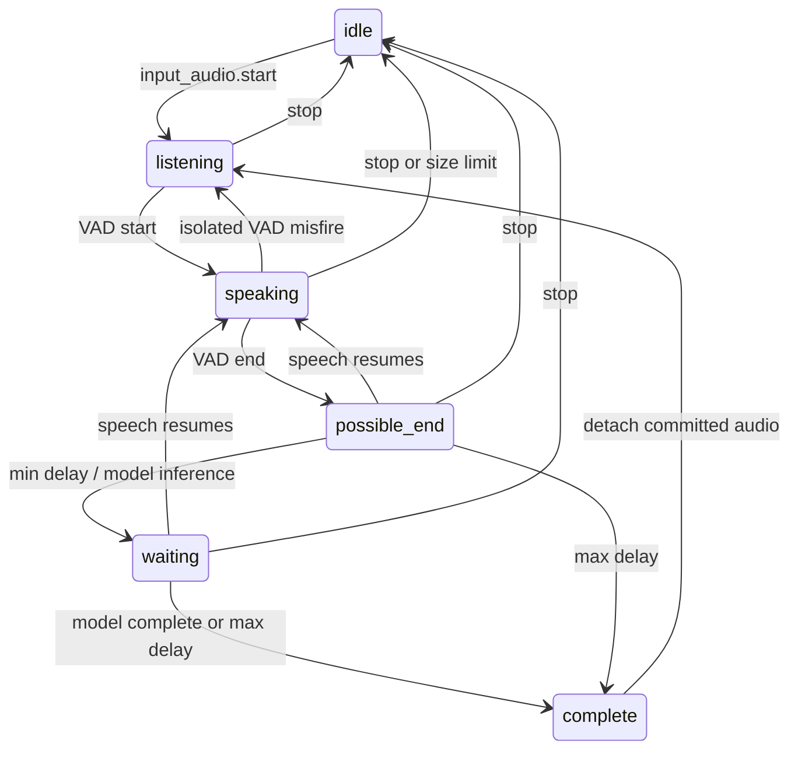

# Realtime Input Runtime

## File manifest

Modified:

- `.gitignore`
- `cmd/engine/main.go`
- `examples/browser/realtime-test.html`
- `internal/realtime/event.go`
- `internal/realtime/session.go`
- `internal/transport/http/realtime.go`
- `internal/transport/http/server.go`

Added:

- `docs/realtime-input.md`
- `examples/browser/realtime-test.test.cjs`
- `internal/providers/turndetection/provider.go`
- `internal/providers/turndetection/smartturn/provider.go`
- `internal/providers/turndetection/smartturn/provider_test.go`
- `internal/realtime/input.go`
- `internal/realtime/input_test.go`
- `internal/transport/http/input.go`
- `internal/transport/http/input_test.go`
- `tools/turn-detector/server.py`
- `tools/turn-detector/requirements.txt`
- `tools/turn-detector/setup.ps1`
- `tools/turn-detector/test_server.py`
- `tools/turn-detector/SMART-TURN-LICENSE`

## Implemented flow

The previous browser buffered a whole VAD utterance and sent `start → PCM → commit`
from `onSpeechEnd`. The new browser starts a stream once, sends Silero's resampled
16 kHz frames throughout speech and silence, and sends VAD metadata independently.

```text
Microphone → Silero v5 onFrameProcessed (32 ms, 512 samples)
           → PCM16 little endian / mono / 16 kHz / binary WebSocket
           → Session input buffer + VAD state
           → minimum endpoint delay → Turn Detection Provider
           → completed turn → existing whisper-cli + ggml-small
           → existing LLM / semantic chunker / TTS / playback timeline
```

No STT, LLM, TTS provider implementation changed. The playback AudioWorklet is
unchanged. On speech start, the browser clears local playback and sends
`generation.cancel` before `input_audio.speech_start`. Detector inference never
runs on the WebSocket read loop or under the Session mutex.

## Provider selection (reviewed 2026-09-24)

LiveKit v1-mini was investigated first:

- [Official docs](https://docs.livekit.io/agents/logic/turns/turn-detector/) describe
  an audio model, local CPU inference, Japanese support, and 16 kHz input.
- The [official Python transport](https://github.com/livekit/agents/blob/main/livekit-agents/livekit/agents/inference/eot/transports.py)
  uses `livekit.local_inference.EOT().predict` with a recent 1.2-second window.
  A small sidecar is technically possible without importing Agents into Go.
- [PyPI livekit-local-inference 0.2.7](https://pypi.org/project/livekit-local-inference/0.2.7/)
  provides Windows x64 wheels for CPython 3.10–3.14.
- The [release announcement](https://livekit.com/blog/solving-end-of-turn-detection)
  distinguishes Apache-2.0 SDK code from the LiveKit Model License. However, the
  [license linked by the current docs](https://huggingface.co/livekit/turn-detector/blob/main/LICENSE)
  restricts standalone use and use with frameworks other than LiveKit Agents
  (sections 1 and 3). This conflicts with the docs' broad usage description.

Consequently this implementation does **not** download or integrate LiveKit model
weights. Standalone usage needs clarification from LiveKit before adopting it.
Merely adding an Agents import to a sidecar would not establish compliance.

The actual connected provider is [Smart Turn v3.2](https://github.com/pipecat-ai/smart-turn):
an established audio model with Japanese support, 16 kHz input and CPU ONNX
inference. Its BSD-2-Clause license permits standalone integration. The Go
provider calls a loopback Python sidecar; neither Pipecat nor LiveKit Agents is
required. Dependencies are NumPy, ONNX Runtime and Transformers' Whisper feature
extractor, plus their transitive dependencies. No PyTorch, GPU or additional STT
model is required. The existing Whisper STT remains unchanged.

The provider boundary is `internal/providers/turndetection/provider.go`:
`Name`, `AudioWindow`, `Detect(ctx, Request)`. Providers receive immutable PCM
snapshots, must support multiple sessions, and must honor cancellation. Model
window sizes, feature extraction, weights and thresholds stay outside Session.
Replacing the model only requires another provider and composition in `main.go`.

The model is pinned to Hugging Face revision
`f766f81d3cfdf7737ac64aad813d91bbfd56bf93`, file `smart-turn-v3.2-cpu.onnx`, SHA256
`2bb026316b14a660486a75b1733cd3fbab8c2fd0314dc9af7be49f8cca967e4f`.
Weights and Python venv are under ignored `runtime/turn-detection/`.
The upstream BSD notice is retained in `tools/turn-detector/SMART-TURN-LICENSE`.

## Session state and endpointing



- Default min delay: **300 ms**; max delay: **2500 ms**, measured after receipt of
  VAD end. Silero's configured 160 ms redemption adds its own detection latency.
- At min delay, snapshot at most the model's 8-second context and run inference.
- Complete: commit immediately. Continuation: retain all current-turn audio and
  wait until max delay. There is one prediction per silence interval.
- Error/unavailable/busy: publish `detector_failed` with an error, then commit at
  max delay. Failure never becomes an immediate positive model result.
- Resumed speech: cancel pending prediction, invalidate its epoch, preserve the
  current-turn buffer and cancel obsolete STT. A subsequent pause gets a new
  prediction. Duplicate speech-end events cannot extend the deadline.
- Isolated VAD misfires return to listening without STT; misfires during a paused
  valid turn preserve that turn and resume endpointing.
- `input_audio.cancel` discards the pending input turn and obsolete STT but keeps
  the input stream. `input_audio.stop` also stops the stream. These do not cancel
  active output generation; `generation.cancel` is the independent output path.
- A committed turn receives its own cancellable response context. Speech start,
  a new commit, input cancellation, generation cancellation or disconnect
  invalidates obsolete transcription. Generation creation checks this context
  atomically under the Session mutex, avoiding stale LLM starts.

Idle audio retains only 500 ms of pre-roll. The full turn is capped at 120 seconds
(configurable); exceeding the cap stops input with an explicit error, never a
silent truncation. At commit the buffer backing storage transfers to STT without
a full utterance copy. Only bounded inference windows are copied.

Runtime has one timer loop and at most one inference goroutine per session.
Disconnect cancels inference and STT; transport waits for input workers. Events
use the existing serialized realtimeWriter. A bounded event queue cancels a
session if its consumer cannot keep up. Browser WebSocket backpressure stops
capture rather than growing the queue indefinitely.

## Protocol

Start once per microphone stream:

```json
{"type":"input_audio.start","data":{"sample_rate":16000,"channels":1,"encoding":"pcm_s16le","mode":"realtime"}}
```

Then continuous binary PCM frames (even length, at most 16 KiB), interspersed with:

- `input_audio.speech_start`
- `input_audio.speech_end`
- `input_audio.vad_misfire`
- `input_audio.cancel` / `input_audio.stop`

Server `input_audio.turn` events contain `state`, `turn_id`, `reason` and optional
`error`. `complete` precedes `input_audio.transcript.final` and generation events.
Client `input_audio.commit` is rejected in realtime mode. Legacy clients omitting
`mode` keep their explicit `start → binary → commit` path.

## Windows setup and manual verification

From the repository root, Python 3.10+ (tested on 3.14 x64):

```powershell
./tools/turn-detector/setup.ps1
runtime/turn-detection/venv/Scripts/python.exe tools/turn-detector/server.py --model runtime/turn-detection/smart-turn-v3.2-cpu.onnx
```

The sidecar loads the model once and binds only to `127.0.0.1:8766`.
`GET /health` reports readiness. Keep this terminal running. In another terminal:

```powershell
$env:TURN_DETECTOR_URL = 'http://127.0.0.1:8766/predict'
$env:TURN_MIN_DELAY = '300ms'
$env:TURN_MAX_DELAY = '2500ms'
$env:TURN_MAX_DURATION = '120s'
go run ./cmd/engine
```

These are the defaults; environment variables are optional and may also be set in
the existing ignored `.env`. The sidecar accepts `--threshold` (default 0.5).
Existing AquesTalk SDK, Whisper executable/model and OpenAI key are still required
to run the full engine.

Serve the browser files separately:

```powershell
python -m http.server 8080 --bind 127.0.0.1 --directory examples/browser
```

1. Open `http://127.0.0.1:8080/realtime-test.html`, Start Audio, Start Microphone.
2. Inspect DevTools WS frames: binary input arrives during speech and silence;
   speech end sends metadata, not a batch upload or commit.
3. Speak a complete Japanese sentence. Observe `possible_end → waiting → complete`
   with reason `detector_complete` (or a model-driven wait followed by `max_delay`).
4. Pause mid-sentence, then continue before the deadline. Check the same turn ID
   resumes speaking, no stale completion appears, and the final transcript covers
   both segments.
5. Speak while AI audio plays. Confirm playback stops immediately, with a
   `generation.cancelled` acknowledgement independent of detector latency.
6. Stop the sidecar and speak. Confirm visible `detector_failed`, then max-delay
   fallback. Restart the sidecar; later turns should recover without engine restart.
7. Stop Microphone / close the page during pending inference or STT. Confirm capture
   stops and the server closes the session without later responses.

## Automated verification and remaining limits

- `go test ./...`: runtime, provider HTTP contract/cancellation and transport
  integration tests, including legacy input, text generation and TTS regressions.
- `go vet ./internal/realtime ./internal/providers/turndetection/... ./internal/transport/http`:
  passes. Full `go vet ./...` reports the pre-existing AquesTalk native-pointer
  conversion at `provider_windows.go:324`; it was not changed in this work.
- `node --test examples/browser/realtime-test.test.cjs`: PCM ordering, immediate
  Barge-in, startup/stop and disconnect behavior using browser API doubles.
- `node --check examples/browser/audio-worklet.js`: playback JS syntax.
- `runtime/turn-detection/venv/Scripts/python.exe -m unittest discover -s tools/turn-detector`:
  sidecar protocol, malformed PCM, busy inference.
- Real Windows model inference via the Go provider:

```powershell
$env:TURN_DETECTOR_TEST_URL = 'http://127.0.0.1:8766/predict'
go test ./internal/providers/turndetection/smartturn -run TestLocalModelSmoke -v
```

The real-model smoke test succeeded (one second of synthetic silence, roughly
203 ms first request). It verifies actual model loading/inference and HTTP wiring,
not Japanese conversational accuracy. Live microphone/speaker and external OpenAI
round-trip validation still require the manual steps above. Race testing could
not run on this host because CGO/C compiler support is unavailable.

The sidecar serializes native inference and returns 503 when busy. Go cancellation
aborts the HTTP request promptly; an already-running native ONNX call finishes in
the sidecar rather than being forcibly interrupted. No inference backlog is kept.
This is a local service, not an authenticated public endpoint. Throughput pooling,
real ring buffers, streaming STT, false-interruption recovery and adaptive pause
statistics remain later work. Endpointing here dynamically chooses between the
configured bounds using actual model decisions; it does not learn per-user delays.
