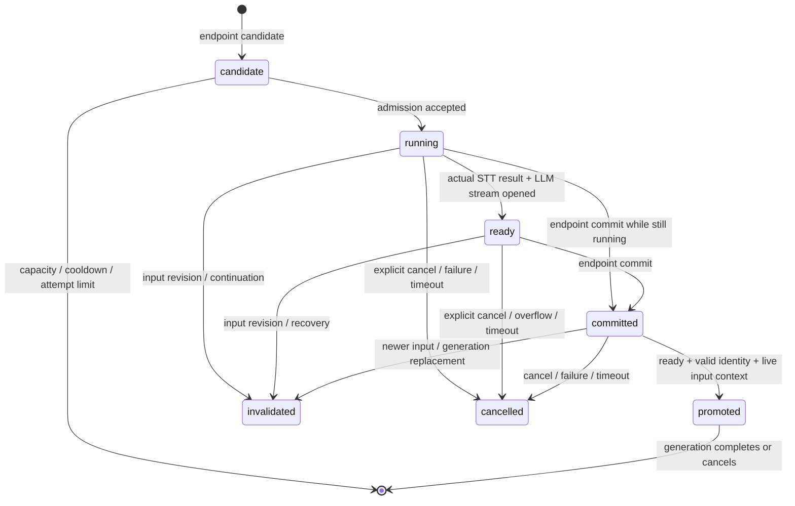

# Preemptive / Speculative Generation

2026-09-24 実装報告。Turn / Interruption / Generation は既存の責務を維持し、
Session に独立した Speculation Runtime を追加した。Whisper の方式・モデル・実行ファイル、
Smart Turn、ブラウザの pause/resume、AquesTalk は変更していない。

## 1. 今回変更した既存ファイル

- `cmd/engine/main.go` — 有効化・時間制限の環境設定。
- `internal/realtime/input.go` — endpoint candidate、確定時の採用、revision 無効化。
- `internal/realtime/session.go` — Runtime 所有、明示的 cancel、ワーカー終了待ち。
- `internal/transport/http/server.go` — 通常／先行 STT 共通の実行枠、設定。
- `internal/transport/http/input.go` — メタデータイベント、採用／通常処理への振り分け。
- `internal/transport/http/realtime.go` — Session 設定と通常／採用済み LLM の共通出力処理。
- `internal/transport/http/input_test.go` — 先行処理無効時の従来 endpoint 回帰テストを明示。
- `docs/realtime-input.md` — 本文書へのリンク。

## 2. 新規ファイル

- `internal/realtime/speculation.go`
- `internal/realtime/speculation_test.go`
- `internal/transport/http/speculation.go`
- `internal/transport/http/speculation_test.go`
- `internal/providers/stt/limited/provider.go`
- `internal/providers/stt/limited/provider_test.go`
- `internal/providers/stt/whispercpp/provider_test.go`
- `internal/providers/llm/openai/provider_test.go`
- `docs/speculative-generation.md`

作業開始時に残っていた Backchannel / Interruption 工程の未コミット変更は保持している。
上記は今回分の一覧であり、`git status` には前工程のファイルも含まれる。

## 3. Speculation state machine

idle は候補未作成（nil）で表す。STT ready と LLM ready は stage で区別する。
候補拒否は本文を持たない fallback メタデータだけを生成する。

## 4. Trigger 条件

既存 input timer が `possible_end → min delay → detector_pending` に進む時点で開始する。
有効な VAD 発話区間、非空 PCM、現在の turn/revision、実行枠・起動間隔・試行数を確認する。
同じ revision は再試行しない。endpoint 用の独立固定 300ms timer は追加していない。

割り込み判定中で観測発話が 800ms 未満なら、短い相槌候補への重い STT 起動を見送る。
800ms 以上なら先行実行できるが、割り込み判定の決定権は既存 Runtime に残る。
この 800ms は既存 sustained-speech policy と対応する起動抑制条件であり、相槌分類器ではない。

## 5. STT speculation

candidate 時点の全ターン PCM を一度コピーし、immutable snapshot として whisper.cpp に渡す。
Smart Turn の末尾 window とは別で、STT の発話先頭は切り捨てない。
snapshot 作成後に到着する VAD 非発話区間の PCM は、同じ revision の後続無音として扱う。
そのため採用時には、追加無音を含めた再認識をせず、元 snapshot の結果を利用する。
発話再開メタデータが届けば必ず revision を更新し、元の音声は通常入力バッファに保持する。
通常 fallback は commit 時の全 PCM を使う。

ready は再利用する。running は同じジョブを引き継ぎ、**開始からの総寿命 45 秒**まで待つ。
commit 後に新たな 45 秒を加算しない。途中で通常 Whisper を重複起動しない。
これは短い固定待機後にモデルを再ロードするより、現在の重い CLI に適した方針として選んだ。
期限到達時は cancel・ワーカー終了後に通常 path へ戻る。

## 6. LLM speculation

実 STT の final transcript が得られた場合だけ既存 `llm.Provider.Generate` を呼ぶ。
架空 transcript、partial の推測、history 更新、tool/action 実行は行わない。
Worker が受け取る能力は STT とテキスト専用 LLM Provider だけで、writer / TTS / engine は渡さない。
delta を byte 数と件数の両方で制限した内部 FIFO に保存する。
採用後は同じ FIFO を先頭から消費し、同じストリームの以降の delta を既存 Pipeline に流す。
採用後の FIFO 満杯は backpressure、採用前の満杯は破棄・fallback とする。

## 7. TTS speculation

先行 PCM 生成は実装していない。既存 `synthesizeSpeechChunk` が合成、Timeline 更新、
chunk イベントと PCM 送信を一つの処理で行うため、先行化には別の artifact 管理が必要になる。
今回は `Promotion` を TTS-ready handoff とし、正式 generation context / Pipeline と
buffered＋live `llm.Stream` を確定後だけ提供する。既存 Semantic Chunker / 正規化 / AquesTalk を再利用する。
将来 PCM artifact を追加する場合も同じ Key、独立した PCM byte 上限、確定後送信を必須とする。

## 8. Commit barrier

`commitTurnLocked` が唯一の入力確定点。interruption pending なら endpointReady だけを記録し、
Speculation は committed に進まない。結果完成イベントから commit を呼ぶ経路は存在しない。
`PromoteSpeculation` は committed、Session の同一 Key、生きた入力 context、期限を lock 下で再確認する。
確定前には通常 transcript、generation.created、response.text、PCM を一切出力しない。
空 transcript の採用では transcript のみを送り、LLM／空の generation を作らない。

## 9. Promotion

`speculation_id → generation_id` を Session lock 下で一度だけ結び付ける。
STT と LLM を再実行せず、保持済み transcript と replay/live stream を返す。
通常経路と採用経路で `consumeLLMStream`、Speech Pipeline、realtimeWriter を共有する。
正式出力のキャンセル、Playback Timeline、音声フレームの JSON/binary 組送信は既存経路のまま。

## 10. Revision / stale protection

Key は `turn_id / speculation_id / revision`、Session ID はイベント envelope と Session 所有で関連付ける。
認識完了、LLM stream open、各 delta、昇格時に Session が現在の仕事と identity を検証する。
入力 revision の無効化と endpoint timer の reset を分け、commit だけで有効 snapshot を破棄しない。
正式出力へ採用済みなら、その後は generation ID と generation context でも照合する。
遅れた結果、旧 generation.cancel、古い入力 context からの昇格を拒否する。

## 11. Cancellation

発話再開、新入力 revision、VAD misfire、回復、input cancel/stop、input 上限、
明示的 generation.cancel、新しい generation.create、disconnect で未採用結果を破棄する。
Smart Turn 継続／失敗、Provider failure、timeout、先行 buffer overflow でも破棄する。
cancel 済みワーカーも終了までは同時実行数に数え、Close はワーカー終了を待つ。
Whisper の既存 `exec.CommandContext` と OpenAI HTTP request context を利用する。
Provider が context を尊重することを契約とし、任意の非協力的 Provider を Go から強制停止はしない。

採用後の発話開始だけでは旧出力を cancel しない。旧 generation は既存の pause/recovery 判定に従う。
確定割り込みによる旧 generation のキャンセルは、新入力の未採用 speculation を巻き添えにしない。

## 12. Backchannel / false interruption

既存 recovery の入力無効化 hook から先行結果を捨て、同じ旧 generation を resume する。
pending 中の ready は昇格しない。true interruption は旧出力を cancel した後、
endpointReady があれば新ターンを commit し、有効な先行仕事を採用する。
先行 transcript を相槌 Policy に自動投入する変更はしていない。

## 13. Dynamic Endpointing

min delay と Smart Turn 開始の時点を共有する。Complete なら既存 commit、
continuation / inference error なら先行仕事を破棄し、既存 max delay fallback を待つ。
max delay、duplicate speech_end、遅い detector の epoch 保護は維持する。
重複 signal や終了待ちワーカーのために、新しい独立 endpoint timer を作らない。

## 14. Resource limits / 設定

| 資源 | 既定値・方針 |
|---|---|
| Session の speculative worker | 最大 1。キャンセル後の終了待ちを含む |
| 同一 turn の speculative 起動 | 最大 3 回、revision ごとに最大 1 回 |
| 起動間隔 | 2 秒。新ターンでも間隔を守る |
| STT 同時実行 | Server 全体で 2。通常・legacy・先行処理が同じ枠を共有 |
| 空き STT 枠なし | speculative は待機せず fallback。通常処理は context 付き待機 |
| 先行処理の寿命 | 開始から 45 秒。promotion 後は通常 generation の寿命へ移管 |
| transcript | UTF-8 text 16 KiB |
| 未消費 LLM delta | 64 KiB、最大 1024 件 |
| PCM snapshot | 既存 MaxTurnDuration に従う。既定 120 秒で 3,840,000 bytes |
| speculative PCM 出力バッファ | 0（先行 TTS 未実装） |
| metadata queue | 既存 64 件。通常制御用に 16 件を残し、余裕がなければ metrics を捨てる |

`SPECULATION_ENABLED`（既定 true）、`SPECULATION_TIMEOUT`（例 `45s`）、
`SPECULATION_COOLDOWN`（例 `2s`）を main で読み込む。
byte 上限・試行回数は `SpeculationConfig` と `Server.SetSpeculationConfig` で変更できる。
timeout は最大 2 分、byte 上限は最大 1 MiB、試行数は最大 16 に制限する。
設定は接続開始前に行う。`SPECULATION_ENABLED=false` で従来の確定後 STT に戻せる。
STT の同時実行枠は無効化時も有効。複数 Server インスタンス／別プロセス間の分散枠ではない。

## 15. Observability

`speculation.started / ready / promoted / invalidated / cancelled / fallback` を送る。
本文は含めず、Key、state、stage、reason、generation ID、duration を記録する。
ready は stt / llm stage があり、STT duration と LLM first-delta latency を得られる。
`saved_ms` は candidate 開始から commit までの再利用可能な先行時間であり、
**実測した end-to-end 短縮時間ではない**。`wasted_ms` も破棄までの経過時間で、CPU 使用時間ではない。
イベント順序は別 writer 呼び出しと前後することがあるため、解析時は Key と stage で関連付ける。
ブラウザの既存 EVENT ログで確認でき、UI や Worklet の追加対応は不要。

## 16. Failure fallback

採用前の STT／LLM failure、期限超過、buffer 超過では先行内容を捨て、通常 STT→LLM→TTS へ戻る。
採用後でも最初の回答 delta を返す前にストリームが失敗した場合は、確定 transcript から通常 LLM を一度再試行する。
既に回答を公開した後の failure は通常 generation のエラー処理を使い、回答を先頭から重複再送しない。
Speculation の失敗だけでは Session を終了せず、Provider の内部エラー本文を metrics に含めない。

## 17. テストと結果

- `go test ./...` — 成功。
- Speculation / promoted-stream テストの 5 回反復 — 成功。
- 関連 package の `go vet` — 成功（realtime、transport/http、STT、LLM、backchannel、turn detection、audio、speech）。
- `go vet ./...` — 既存 AquesTalk `provider_windows.go:324` の `unsafe.Pointer` 警告が残る。
- `node --test examples/browser/audio-worklet.test.cjs examples/browser/realtime-test.test.cjs` — 11 件成功。
- `node --check examples/browser/audio-worklet.js` — 成功。
- helper 子プロセスのキャンセル／Run 終了／一時 WAV 削除 — 成功。
- 配置済み `whisper-cli.exe` + `ggml-small.bin` の 200ms deadline smoke — 成功（約 0.21 秒で戻る）。
- OpenAI Provider の localhost SSE cancellation test — 成功。実サービスへの課金 API 呼び出しは行っていない。
- `go test -race ./internal/realtime ./internal/transport/http` — CGO 無効のため実行不可。並行 ID/cancel テストと反復試験を実施。
- Python はコード・依存変更なしのため今回対象外。

自動試験は candidate、duplicate、resume、revision、遅い結果、ready/running reuse、一度限りの昇格、
interruption pending／回復／確定、timeout、deadline と昇格の競合、Provider failure、buffer／試行数／起動間隔、
disconnect、input cancel/stop、generation ID、継続判定、空 transcript、通常 fallback を含む。
WebSocket 試験で、確定前の transcript／回答／binary PCM がないことと TTS 未起動を直接確認する。
従来の health、TTS endpoint、legacy input、text realtime、Smart Turn、pause/resume の回帰試験も維持する。

## 18. 実機確認

Smart Turn sidecar と Engine を起動し、ブラウザで通常発話、間を置いた言い直し、短い相槌、
長い割り込み、発話停止、接続切断を試す。確定前に音声が出ないこと、訂正前の内容が回答されないこと、
相槌後の旧音声が未再生位置から再開することを耳でも確認する必要がある。
CPU 負荷、起動回数、先行仕事の採用率、wasted_ms、最初の PCM までの時間を
有効／無効設定で比較する。日本語実会話の品質・実 latency はまだ測定していない。

## 19. 現 Whisper の限界

process-per-utterance、モデル再ロード、final only、non-streaming はそのまま。
通常は Smart Turn inference と重なる時間が短く、Whisper が遅い場合、commit 前の LLM 先行まで到達しない。
45 秒を超える認識では通常 path への再試行がむしろ latency を増やす可能性がある。
CUDA、persistent model、native binding、Partial/Streaming STT は追加していない。

## 20. 将来の Streaming STT

入力側で partial transcript の revision を付け、同じ Key に結び付いた LLM 開始処理へ渡せる。
訂正 partial は revision を更新して旧仕事を cancel、STT snapshot 段だけを置き換える。
Session の identity 検証、commit barrier、buffered/live stream、generation promotion は再利用する。
実装時には partial 供給境界と認識済み音声範囲の対応を追加し、revision を更新せず内容を書き換えてはならない。
外部 tool/action は speculative Worker に実行能力を渡さず、commit 後の正式 executor 側に置く。

## 21. 既知の問題・制限

- PCM snapshot の正しさは、ブラウザが PCM と VAD metadata を順序通り送る既存プロトコルに依存する。
  speech_start を送らずに新発話 PCM だけを送るクライアントを server VAD で補正する機能はない。
- Whisper 出力は既存 Provider 内で一旦取得される。16 KiB 制限は Runtime が保持・LLM に渡す transcript の上限であり、
  Provider 内部や OS／モデル全体のメモリ使用量を制限するものではない。
- 通常 STT と先行 STT の admission は先着順で、通常処理の優先キュー／横取りはない。
- 回復 policy の日本語精度、VAD の誤検知、音声環境依存の制約は前工程から継続する。
- speculative TTS、history、tool execution、partial STT 本体は未実装。
- race detector 未実行と既存 AquesTalk unsafe.Pointer 警告が残る。

git commit / git push は実行していない。
